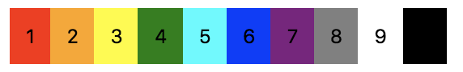

## 前言概述

就目前的网络中出现的资料来看，对于 flex 布局的介绍已经有很多了，而且我自己也曾经在公众号中对 flex 的部分属性写了点东西。但这还远远不够，心里总想再写点什么来更全面地介绍有关 flex 的运用，拖延症严重的我在 2020 年终于开始写了，希望不会太迟。其实内心还有一种抗拒的声音在告诉我：你写的东西不会有人看的，大家其实对 flex 布局已经了解地很透彻了。

不过现在既然已经动手了，我就会继续坚持下去，无论最终结果怎么样，通过这次对 flex 的梳理，我完全相信我自己对 flex 布局又有了一次新的认识。那么，如果你阅读完了所有章节内容之后，也有所收获的话，可能是双方都开心的事情了。

在开始具体内容之前，先简单跟各位提几点：

- 不谈 flex 版本历史，但会介绍 flex 相关属性；
- 不考虑 CSS 其他属性，只是聊聊 flex 的一些相关联的属性运用方式；
- 不会有太多页面美化相关的细节内容，就看一下 flex 能做什么；
- 不看兼容性，默认支持 flex 属性，如要考虑兼容老版本的 flex 写法，代码处理工具有很多，可以网上搜一下；

## 代码约定
所谓的代码约定，其实也并没有太多内容可约定的，只不过想跟大家说一下，后面我就不再一一强调文中的 demo 的 HTML 结构是怎么样的，以及父级元素已经默认被我“设定”为 `display: flex;` 属性了。

### HTML 部分
在文中不会一直重复放 HTML 结构内容，因为 flex 布局的灵活性，我会尽可能使用下面的 DOM 结构来做 demo，如有特殊情况会额外说明。

```html
<div class="demo">
  <div class="item item_1">1</div>
  <div class="item item_2">2</div>
  <div class="item item_3">3</div>
  <div class="item item_4">4</div>
  <div class="item item_5">5</div>
  <div class="item item_6">6</div>
  <div class="item item_7">7</div>
  <div class="item item_8">8</div>
  <div class="item item_9">9</div>
  <div class="item item_0">0</div>
</div>
```

很简单的一个结构，className 我也就直接点， `.demo` 和 `.item` 就好了。其实呢，这个 `.item`  正常来说也可以省掉，因为我们可以使用结构选择器 `:nth-child(n)` 的方式来选择节点元素，而且因为我们主要是聊 flex 布局相关的，甚至可能不会使用到这些选择器，无论怎么样，这些目前看起来并不是重点。

不过在这里，我还是选择了增加一个 `.item_*` 这样的 className 方式，主要是考虑后续可能会针对某个 **item** 做样式上的调整时能够更直观地体现是对哪个元素。

上面这部分是 demo 展示相关的部分，那么很显然，这些 HTML 是放到 `<body></body>` 标签内的，这里就不再赘述了。

### CSS 部分
现在这个 demo 中全部都是用 `div` 标签了，也没啥可以 reset 的，浏览器表现都是一样的，不过我们既然要谈 flex 布局，所以，在这里我们会对最外层的 `div` 标签增加一个 `display: flex;` 属性，让其子元素按照 flex 的特性来布局。

```css
.demo {
	display: flex;
}
```

其他的有关 flex 特性的属性值我们一律采用默认值。那么现在我们可以看到浏览器中的表现结果应该是这样的：


是的，毫无任何修饰的一个数字排列。为了能够更好的凸显每个 `.item` 元素的位置，这里我给十个颜色值来代表每个 **item** 元素，顺便增加点 `padding` 然后元素显得饱满点。



```html
<div class="demo">
  <div class="item item_1" style="background-color: red;">1</div>
  <div class="item item_2" style="background-color: orange;">2</div>
  <div class="item item_3" style="background-color: yellow;">3</div>
  <div class="item item_4" style="background-color: green;">4</div>
  <div class="item item_5" style="background-color: cyan;">5</div>
  <div class="item item_6" style="background-color: blue;">6</div>
  <div class="item item_7" style="background-color: purple;">7</div>
  <div class="item item_8" style="background-color: grey;">8</div>
  <div class="item item_9" style="background-color: white;">9</div>
  <div class="item item_0" style="background-color: black;">0</div>
</div>
```

是的，现在看到的这个 HTML 结构就是后面所有 demo 的基本参照。为了让这个 HTML 结构看着舒服一点，我们把 `style` 中的 `background-color` 放到 CSS 文件中，通过 `.item_*` 这个类名来匹配吧。这点在后面也就不再具体说明了。

### 最终的 HTML 和 CSS 默认结构
```html
<!DOCTYPE html>
<html lang="zh-cn">
<head>
  <meta charset="utf-8">
  <meta name="viewport" content="width=device-width, user-scalable=no, initial-scale=1.0, maximum-scale=1.0, minimum-scale=1.0, minimal-ui, shrink-to-fit=no">
  <meta http-equiv="X-UA-Compatible" content="ie=edge">
  <title>一个关于 flex 布局的 demo 示例</title>
	<link rel="stylesheet" href="flex_demo_default.css" />
  <!-- 不同的 demo 将会以序号形式引入 -->
	<link rel="stylesheet" href="demo/flex_0001.css" />
</head>
<body>
  <!-- 以下 .demo 部分为后续代码示例主要内容，其他将会忽略 -->
  <div class="demo">
    <div class="item item_1">1</div>
    <div class="item item_2">2</div>
    <div class="item item_3">3</div>
    <div class="item item_4">4</div>
    <div class="item item_5">5</div>
    <div class="item item_6">6</div>
    <div class="item item_7">7</div>
    <div class="item item_8">8</div>
    <div class="item item_9">9</div>
    <div class="item item_0">0</div>
  </div>
  <!-- 以上 .demo 部分为后续代码示例主要内容，其他将会忽略 -->
</body>
</html>
```

```css
/* 这是 flex 布局相关 demo 的默认样式 flex_demo_default.css */
/* 默认的这部分样式不会改变，新增的功能将以新的 CSS 文件形式引入到 HTML 页面中。 */
.demo {
	display: flex;
}
.item {
	padding: 10px;
}
.item_1 {
  background-color: red;
}
.item_2 {
	background-color: orange;
}
.item_3 {
	background-color: yellow;
}
.item_4 {
	background-color: green;
}
.item_5 {
	background-color: cyan;
}
.item_6 {
	background-color: blue;
}
.item_7 {
	background-color: purple;
}
.item_8 {
	background-color: grey;
}
.item_9 {
	background-color: white;
}
.item_0 {
	background-color: black;
}
```

### 其他说明
现在所看到的效果将会是后续所有 demo 的一个根基，具体的则是按照每个章节中所提到的内容而改变，各位看官可要注意 `.item_*` 这里的改变，比如我们可能随时把排在最后的 `.item_0` 元素通过 flex 布局的方式移到最前面，或者是中间的某个位置。