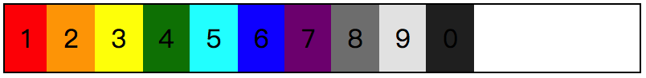
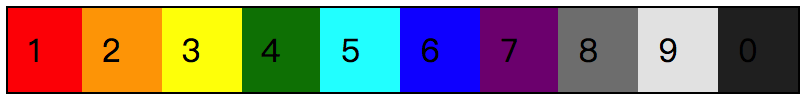
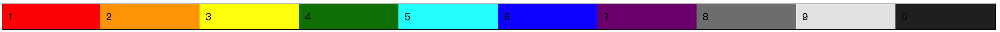
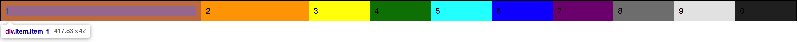
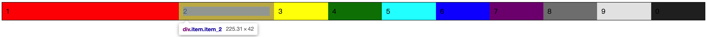
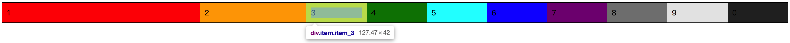
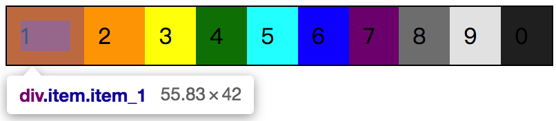
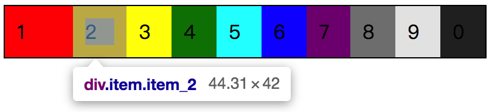
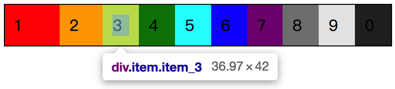
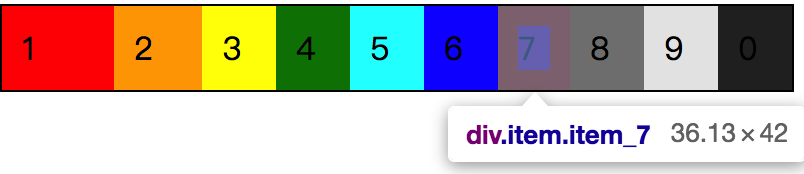

在 flex 容器中，每个 flex 元素所占用的空间是可以控制的，不仅可以按照特定比例来分配，也可以按照某个固定的值来分配。主要涉及到的属性有：`flex-grow`  、`flex-shrink` 以及 `flex-basis` ，这三个属性可以缩写为 `flex` 来描述，具体的后面我们会逐个介绍。

现在我们先来看一下 `flex-grow` 的作用，从 **grow** 这个词可以看出，`flex-grow` 主要是作用是计算分配一个 flex 元素在 flex 容器中被分配的比例值，属性值为纯数字，可以是带小数点的数字，`flex-grow: 1;` 与 `flex-grow: 1.5;` 都是合法的。

`flex-grow` 所计算的结果是宽还是高，主要是由“主轴”来决定的，也可以理解为，`flex-direction` 将影响 `flex-grow` 所计算的结果是宽还是高。

由于 `flex-grow` 是计算 flex 元素可伸展的空间，会可获得最小空间的基础上，按照特定比例去分配空间，如果每个 `flex-grow` 的值是相同的话，那么所有 flex 元素将被会平均分配，至于 `flex-grow: 1;` 还是 `flex-grow: 100;`，结果都是一样的。

而如果每个值都不同的话，那么每个 flex 元素将会根据特定的比例去获得相对应的宽度。需要注意的是，`flex-grow` 的默认值是 `0` ，如果没有设置值的话，flex 元素将不会被分配剩余的空间，而完全是由元素自身的内容来撑开。

## 特性分解

### 默认值的情况

一般在使用 flex 弹性布局的时候，都是直接在 flex 容器层直接写 `display: flex` ，而不会去考虑 flex 元素自身的变化，那么可以得到下图的一个效果，因为 `flex-grow` 的**默认值**是 `0` 。




### 相同 flex-grow 值的情况

而当我们改变了默认值，统一设置一个值给 `flex-grow` 的话，情况就会马上不同。

```css
/* 
  file: flex_0042.css
  当给 flex 元素设置 flex-grow: 1; 后的情况；
*/
.demo {
  /* 在这里给 flex 容器设置了高度 */
  border: 1px solid #000;
}
.item {
  flex-grow: 1;
}
```



我们可以看到现在的 flex 容器已经被填满了，并且每个 flex 元素的宽度都是相同的。如果这个时候我们改变浏览器的宽度，得到的结果将会是每个 flex 元素的宽度变大了，但还是相同的宽度。




### 根据比例分配的情况

而如果我们现在调整了其中两个 item 的 `flex-grow` 属性值，让其与其他元素形成对比的话。

```css
/* 
  file: flex_0043.css
  改变其中两个 item 的 flex-grow 值后的情况；
*/
.demo {
  /* 在这里给 flex 容器设置了高度 */
  border: 1px solid #000;
}
.item {
  flex-grow: 1;
}
.item_1 {
  flex-grow: 4;
}
.item_2 {
  flex-grow: 2;
}
```

按照目前这个情况来预计，`.item_1` 是 `.item_2` 的两倍，`.item_2` 是其他 item 元素的两倍。那么实际的效果是不是这样呢？







从截图的数据来看，近似于我们的预期结果。

| flex 元素 | 宽度(px) |
| ------- | ------ |
| .item_1 | 417.83 |
| .item_2 | 225.31 |
| .item_3 | 127.47 |


### 宽度无法按比例分配的情况

按照上面这个 demo，如果我们缩小浏览器的话，可能得到的结果就是这样了。









从图中我们可以看到，现在我们所得到的结果，已经与我们所预期的结果产生了较大的偏差了。主要是因为按照分配后的空间已经无法得到满足，在保证最小可能的情况下容纳元素去分配空间。

## 小结

就现在我们还仅仅只是初步了解了 `flex-grow` 的一些特性，后面结合 `flex-basis` 以及 `flex-shrink` 属性，我们将会迎来在 flex 布局中诸多“不可控”的场景。

