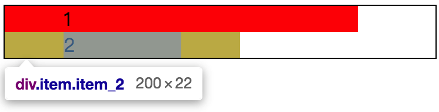
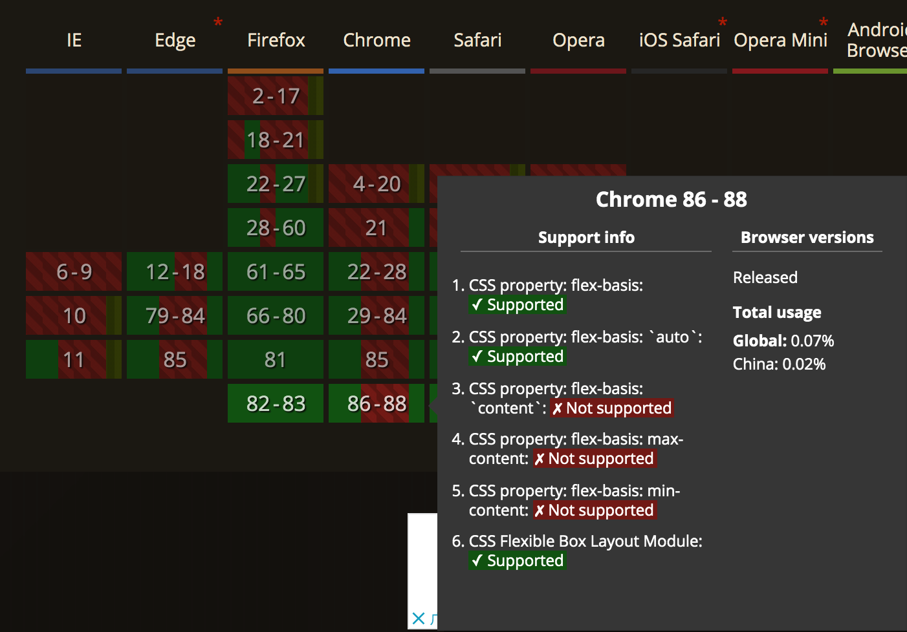

# 📕 flex 元素：flex-basis

在前面了解了 flex 元素的伸（`flex-grow`）缩（`flex-shrink`）特性之后，我们还要知道在 flex 元素中，是可以设置该元素在“主轴”上的初始大小。如需要设置 flex 元素在“主轴”上的初始大小，就需要使用 `flex-basis` 这个属性。

首先，需要注意一点，`flex-basis` 是设置了 flex 元素的初始大小，换言之，就是设置了 flex 元素的“宽度”。这所谓的“宽度”是相对于“主轴”而言的，可能是 `width`，也有可能是 `height`，总之，就是盒模型中内容区域的尺寸。提到了盒模型，必然需要注意 `box-sizing` 的值将会影响最终我们所设定在 `flex-basis` 中的值。

```css
/* 
  file: flex_0047.css
  box-sizing 的值对 flex-basis 的影响。
*/
.demo {
  flex-wrap: wrap;
  /* 在这里给 flex 容器设置了高度 */
  border: 1px solid #000;
}
/* 从第三个 item 开始隐藏，暂时不需要 */
.item:nth-child(n+3) {
  display: none;
}
.item {
  flex-shrink: 0; /* 不可收缩 */
  flex-basis: 200px; /* 基于不可收缩，flex 元素初始大小 */
  padding: 0 50px; /* 增加左右内间距，结合 box-sizing 对比效果 */
}
.item_1 {
  box-sizing: content-box;
}
.item_2 {
  box-sizing: border-box;
}
```



结合效果图基本上已经能够很直观得展示了 `box-sizing` 在 `flex-basis` 也是有影响的。当然，目前现在看到的这个情况是因为 `flex-grow` 的默认值为 `0`，以及设置了 `flex-shrink: 0;`，所以这两个 flex 元素是不会伸缩的。

## 特性分解

### 默认值

在 `flex-basis` 中的**默认值**是 `auto`，这也是 `flex-basis` 的关键词属性值。而关键词属性值并非只有 `auto` 这么一个，还有下面这几个：

* `fill`
* `content`
* `fit-content`
* `min-content`
* `max-content`

具体这几个有什么含义呢？从字面上我们基本上也可以理解了，实际效果的话，暂时就先不管吧，因为目前为止通过 caniuse 查找 `flex-basis` 的兼容性（https://caniuse.com/?search=flex-basis），大部分浏览器都不支持，在不支持的前提下，最终都是**默认值** `auto` 而已。



`flex-basis: auto;` 的主要作用是让 flex 元素由内容来决定大小。


### 指定具体的值

指定具体的值这个就完全看具体的情况来使用了，比如想要实现一行三列平均分的情况，我们可以使用 `flex-basis: 33.33%;` ，再比如前面我们的 demo 中所用的值是 `200px`。总之，只要不是负值，再结合 CSS 中的长度单位值就可以了。


## 小结

`flex-basis` 比较纯粹，就是控制 flex 元素在“主轴”上的初始大小，最终的值可能会被以下因素影响：

* `flex-grow` 和 `flex-shrink` 的值；
* `box-sizing` 下不同盒模型的计算方式；
* `min-width` 或者 `min-height` 的值；
* `transform` 或者 `zoom` 的值；
* ……

当然，在 CSS 的世界中，还有很多可能性的存在，想要完全概括似乎有点难，对于 `flex-basis` 通俗点讲，就是与盒模型有关的，会改变“盒子”尺寸的属性，都有可能会有影响。