在 flex 元素中使用频率较高的应该是 `flex` 这个属性了，该属性是一个简写属性，包含了 `flex-grow`、`flex-shrink` 以及 `flex-basis` 这三个属性。由于这三个属性的属性值自身特点，所以，`flex` 属性的单位值可以为：

* 无单位、纯数字，且必须大于等于 **0**，主要作用于 `flex-grow` 和 `flex-shrink`；
* 具有有效单位的值，主要作用于 `flex-basis`；
* 特定的关键词；

而作为简写方式存在的 `flex` 属性，所拥有的属性值包含了：一个值、两个值以及三个值的写法。在进一步了解这三种属性值写法之前，我们要先记住上面提到的 `flex` 属性值的写法特色。

> **注意：** `flex` 属性中每个属性其自身原有的默认属性值保持不变，如在 `flex` 未特别处理声明，将会使用默认值。

### 一个值的 `flex` 属性

在日常前端开发过程中，普遍前端开发人员在写 flex 布局时，是直接使用 `flex: 1;` 或者 `flex: 0;` 来使用的。对于这样的处理方式，相对来说 `flex` 这个简写方式带来了不少遍历，并且能够快速满足 flex 布局中每个元素的伸缩特性。

但这样盲目地使用，相对而言是不够严谨的。在本文开头已经提到了 `flex` 的几种属性值的写法，根据这几种写法，大概罗列后为：

```css
/* 
  file: flex_0048.css
  flex 仅有一个属性值时的情况，主要是为了观察在 DevTools 中解析 flex 后每个值的变化；
*/
.demo {
  flex-wrap: wrap;
  /* 在这里给 flex 容器设置了高度 */
  border: 1px solid #000;
}
/* 仅为了观察 flex 属性值的变化，隐藏部分不需要的元素 */
.item:nth-child(n+9) {
  display: none;
}
.item_1 {
  flex: 3;
}
.item_2 {
  flex: 1;
}
.item_3 {
  flex: 0;
}
.item_4 {
  flex: 0%;
}
.item_5 {
  flex: 200px;
}
.item_6 {
  flex: auto;
}
.item_7 {
  flex: none;
}
.item_8 {
  flex: initial;
}
```

一步到位，把几种情况展示一下。以上 demo 对于浏览器的渲染结果暂不做考虑，而仅从 DevTools 中去查看每个 **item** 在不同的 `flex` 属性值下的解析结果。

#### item_1 && item_2

显然，这两个 **item** 的主要区别就是数字的大小不同，主要是考虑更容易区分 `flex-grow` 和 `flex-shrink` 的默认值。

首先我们来看 `flex: 3;` 的结果：

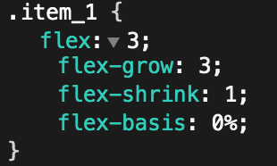

从结果可以看到，`flex-grow` 的值改变了，而 `flex-shrink` 保持着默认值为 `1` 的结果，至于 `flex-basis` 不再是 `auto` 这个默认值，而是转为 `0%`，同理，`flex: 1;` 的结果，应该也就是 `flex-grow` 为 `1`，具体的我们可以看 **.item_2** 的结果。

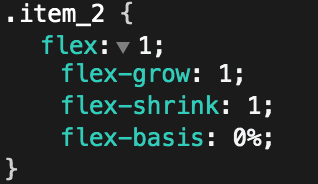

所以，最终，`flex` 值为大于 0 的无单位值的数字时，将代表该元素是可伸缩的元素，至于伸展的比例就需要根据最终的值而定。

#### item_3

平时我们需要让一个 flex 元素可伸缩的，都会写 `flex: 1;`，反之，如果不想要一个 flex 元素可伸缩的话，那么就是写 `flex: 0;`。而这个 **0** 所代表的都有哪些呢？是将三个属性值都设置为 **0** 吗？其实并不是，而只是把 `flex-grow` 设置为 **0** 而已。

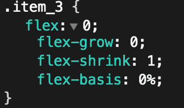

##### 临时小结一下

从上面可以结果我们可以发现，当 `flex` 的属性值为一个值的时候，且该值不具备单位值时，相当于展开后，只是修改了 `flex-grow` 的值，而不会改变 `flex-shrink` 的值。至于 `flex-basis` 则从默认值 `auto` 转为 `0%`，从页面效果来说，并没太大差别。

简单理解就是：`flex` 的属性值没有单位值时，相当于在修改 `flex-grow` 的值。

#### item_4

在这个 flex 元素中，我们给的单位值是 `0%`，最终得到的结果是：

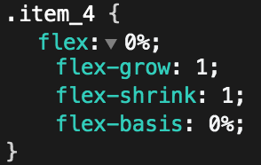

从结果来看，`flex: 0%;` 与 `flex: 1;` 的结果是相同的。

#### item_5

那么我们把 `0%` 改为 `200px` 的话，得到的结果会是怎么样呢？

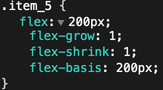

##### 临时小结一下

从这两个 **item** 的结果来看，当 `flex` 的值具有单位值时，会将 `flex-grow` 的默认值从 `0` 转为 `1`，让该元素变成可伸展；而不会改变 `flex-shrink` 的默认值，因此该元素也是可缩的；而最终有单位值的这个属性值是作用于 `flex-basis`。

简单理解就是：`flex` 的属性值如有单位值将改变该元素的初始大小，并且该元素是可伸缩的。

#### item_6

`flex: auto;` 看到这里的 `auto`，回想一下，这其实是 `flex-basis` 的默认值。仅作用于 `flex-basis` 时，其他两个属性值在未指定的情况下，回头看一下 **item_5** 的结果，所以，现在我们得到的最终结果就是：

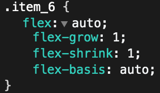

一个可伸缩，并且宽高是由内容决定的 flex 元素。从效果上来看与 `flex: 1;` 并没有太大的差异。

#### item_7

`none` 在 CSS 中绝大部分情况下所代表的是类似**无**、**没有**之类的含义，所以 `flex: none;` 也不例外，表示当前 flex 元素不可伸缩，换言之，就是不具备弹性的功能了。仅只能依靠元素自身的内容来撑开宽高，因为 `flex: none;` 解析后的情况是：

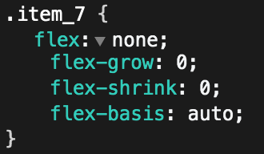

需要注意，`flex: 0;` 并不等于 `flex: none;` 如果想要让一个 flex 不具备伸缩弹性功能，是要写 `flex: none;` 而不是 `flex: 0;`。

#### item_8

`initial` 在 CSS 中所代表的是初始值，所以 `flex: initial;` 这个就好理解了，解析后是：

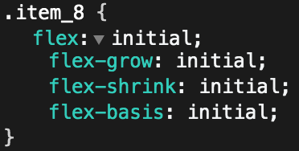

再回想一下这三个属性的默认值是什么，那么就可以知道这里的每个 `initial` 所代表的含义了，也就是说 `flex: initial;` 等同于 `flex: 0 1 auto;`，也就是 `flex-grow: 0; flex-shrink: 1; flex-basis: auto;` 当我们需要对某个 flex 元素进行重置为初始值的时候，就可以考虑使用了。

#### 小结

从以上的几种情况来看，`flex` 属性值为单个属性值时，是否带有单位将会影响最终所作用的属性值，但无论如何，单属性值是不会修改 `flex-shrink` 的值，而是：

* 无单位值：虽然仅作用于 `flex-grow` ，但是会将 `flex-basis` 的默认值 `auto` 转为 `0%`；
* 有单位值：再改变 `flex-grow` 为 `1` 的情况下，将具体的值作用于 `flex-basis`；
* 关键词：不同的关键词代表着不同的含义
  * `auto`：可伸缩，初始大小为元素自身内容所撑开的宽高；
  * `none`：不可伸缩，元素仅依靠自身内容撑开；
  * `initial`：设置元素弹性特性为默认值，可缩不可伸，初始大小为元素自身内容所撑开的宽高；


### 两个值的 `flex` 属性

当 `flex` 属性有两个属性值的时候，虽然不区分前后顺序，但是需要注意有且只能有一个属性值是有单位值，或者关键词。以下三种情况会被情况会被浏览器视为无效属性值：

* 含有 **initial** 属性值时，如：`flex: initial 200px;`
   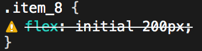
* 含有 **none** 属性值时，如：`flex: 7 none;`
  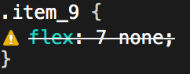
* 两个属性值都有单位值时，如：`flex: 200px 0%;`
  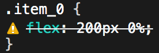

```css
/* 
  file: flex_0049.css
  flex 有两个属性值时的情况，主要是为了观察在 DevTools 中解析 flex 后每个值的变化；
*/
.demo {
  flex-wrap: wrap;
  /* 在这里给 flex 容器设置了高度 */
  border: 1px solid #000;
}
.item_1 {
  flex: 3 200px;
}
.item_2 {
  flex: 200px 2;
}
.item_3 {
  flex: 0 4;
}
.item_4 {
  flex: 4 6;
}
.item_5 {
  flex: 5 auto;
}
.item_6 {
  flex: auto 6;
}
/* 以下情况会被浏览器视为无效属性值 */
.item_7 {
  /* 如其中一个为 auto，另外一个必定是无单位的值，否则将会报错 */
  flex: 200px auto;
}
.item_8 {
  /* 当含有 initial 的时候，也不可以其他属性值存在 */
  flex: initial 200px;
}
.item_9 {
  /* 当含有 none 的时候，也不可以其他属性值存在 */
  flex: 7 none;
}
.item_0 {
  /* 当出现有两个具有单位值的属性值时 */
  flex: 200px 0%;
}
```

如上述的 demo 中，**item_1** 到 **item_5** 都是可被正常解析的属性值，从中我们可以看到有一个单位值的或者存在 `auto` 的都是可以被正常解析，因为是作用于 `flex-basis` 属性的。那么没有单位值的数字是作用于 `flex-grow` 呢还是 `flex-shrink` 呢？

结合单属性值的情况，我们可以猜想的结果是：

* **一个有单位值，一个没有单位值的情况**：有单位值的必定是 `flex-basis`，而无单位值的则会是 `flex-grow` 的结果，并且这两个值的顺序如何并不会影响最终的结果；

  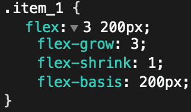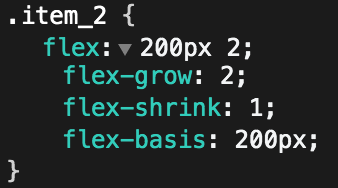

* **两个都为无单位的值**：当两个都为无单位的值时，将会根据数值的出现顺序先后作用于 `flex-grow` 以及 `flex-shrink`，同时将 `flex-basis` 调整为 `0%`；
  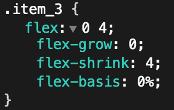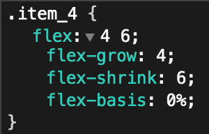

* 其中**一个值为 `auto` 的话**，**另外一个必然是无单位**的属性值，否则将会报错；
  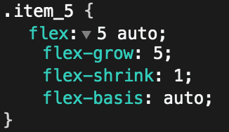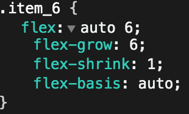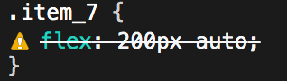


### 三个值的 flex 属性

三个值的情况就简单的，展开后分别就是对应 `flex-grow` 、`flex-shrink` 已经 `flex-basis` 这三个属性，书写的时候，对于 `flex` 属性值的顺序需要注意一下几点：

* `flex-grow` 和 `flex-shrink` 这**两个无单位的属性值必须写在一起**，且先后顺序必定是先 `flex-grow`，再是 `flex-shrink`；
* `flex-basis` 可以在最后一个也可以在第一个位置，唯独**不能在中间**；
* 关键词属性值的使用，**仅只有 `auto` 可以用**，且不能在两个无单位的属性值中间，以及**不能与有单位的属性值同时出现**；


### 归纳一下

`flex` 属性是平时大家使用率较高的一个属性，往往都只是写了 `flex: 1;`，那么对于单个属性值的情况，我们需要注意有单位值和无单位值的一个区别。接着呢，就是需要注意一下三个属性值的时候，每个值不同所带来的影响，比如：

* `flex: 1 0 100%`;
* `flex: 0 0 100%;`
* `flex: 1 1 50%;`
* ……

诸如此类的组合方式最终在一个 flex 布局中所带来的作用和影响会是怎么样的。有兴趣的可以阅读一下我的这篇 2017-12-06 写的公众号文章：《[又一次想说 flex 布局挖坑给你，信吗？](https://mp.weixin.qq.com/s/OsVzMZtJeWpz-8gcQI_ySQ)》