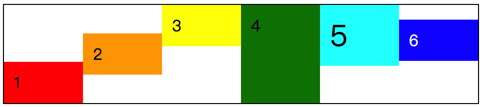

# 📕 flex 元素：align-self

在前面 flex 容器部分中，我们了解了一遍有关 `align-items` 的属性，这个属性的主要作用是控制所有的 flex 元素在“交叉轴”方向的对齐方式。注意哦，是控制该 flex 容器中所有的 flex 元素的对齐方式。这里强调了“**所有**”这两个字，也就说明我们是可以对每个 flex 元素设置不同的对齐方式，同样也是基于“交叉轴”方向的。


如上图所示，我们将第一个 **item** 的位置往下挪了点，准确地说应该是，我们将这个 **item** 元素设置为底部对齐了。

```css
/* 
  file: flex_0050.css
  基于 demo_26 中描述 align-items: flex-start; 效果的前提下
  对 .item_1 使用 align-self 的效果。
*/
......
/* 对 .item_1 增加 align-self: flex-end; 的样式 */
.item_1 {
  align-self: flex-end;
}
```

这个 demo 是基于 **demo_0026** 做的修改，将 `.item_1` 的对齐方式修改为底部对齐。

## 属性介绍

`align-self` 的属性值与 `align-items` 几乎是一样的，仅仅只是多了一个 `auto` 属性值而已。

* `auto`
* `flex-end` 
* `flex-start`
* `center`
* `baseline`
* `stretch`
* `normal`

如已经了解 `align-items` 属性的话，那么对于 `align-self` 的理解就简单很多的，这里也就不打算再详细得重复描述每个属性值。若有不清楚的可以查看 `align-items` 的属性介绍。

### auto

`auto` 是 `align-self` 的默认值，主要的作用是让当前 flex 元素的对齐方式参照 flex 容器所设置的 `align-items`。

### flex-end

将当前 flex 元素相对于“交叉轴”的**底部**进行对齐，效果如本章前面的那张截图。

### flex-start

将当前 flex 元素相对于“交叉轴”的**顶部**对齐。

### center

将当前 flex 元素相对于“交叉轴”的**中间部分**对齐，也就是相对于“交叉轴”垂直居中对齐该 flex 元素。

### baseline

`baseline` 还是文本的基线对齐方式，所以，当我们如果每个 **item** 的文字大小不一样的话，可能就会得到这样的一个效果。


在这个截图中我们可以看到第一行元素的文字大小都是不同的，也就导致了元素的排列高低错落。在错落的排列中，我们可以发现文字的对齐方式还是很统一的：以最大的文本基线为基准来对齐所有的元素。

而在截图的第二行中，由于文字大小都是一致的，所以，看到的对齐方式就很平整了。

```css
/*
  file: flex_0051.css
  align-self: baseline; 时，不同文字大小的效果；
*/
.demo {
  flex-wrap: wrap;
  align-items: flex-start;
  height: 200px;
  /* 在这里给 flex 容器设置了高度 */
  border: 1px solid #000;
}
.item {
  width: 60px;
  /* 将所有的 item 元素对齐方式设置为 baseline */
  align-self: baseline;
}
/* 设置不同的 font-size 来观察元素的对齐变化 */
.item_1 {
  font-size: 30px;
}
.item_2 {
  font-size: 60px;
}
.item_4 {
  font-size: 20px;
}
.item_5 {
  font-size: 10px;
}
```

（🤔）按照上面的这个 demo，如果我们在 `.item_2 {}` 中修改 `align-self` 的对齐方式，比如 `flex-start` 的话，会是怎么样呢？

```css
/*
  file: flex_0052.css
  基于 demo_51 将 item_2 的 align-self 对齐方式修改
*/
......
.item_2 {
  /* 修改 item_2 元素的 align-self 为 flex-start */
  align-self: flex-start;
  font-size: 60px;
}
......
```

这时我们可以看到有两个元素是顶着 flex 容器边缘的。首先，**item_2** 必定是顶着边缘的，因为 `align-self` 的值是 `flex-start`，那么 **item_1** 顶着边缘是为什么呢？最简单的理解方式呢，我们只要把所有的文字大小属性去掉，就会发现每个元素都是顶边的。


那么 **item_1** 目前是 `baseline` 对齐方式中，文字最大的一个，所以，必然是顶边了。而 **item_3**、 **item_4**、 **item_5** 这三个元素呢，都要相对于 **item_1** 的基线来对齐。在这个 `baseline` 对齐的队伍中，唯有 **item_2** 是不同的。

### stretch / normal

`strech` 属性值的作用是相对于“交叉轴”的位置，将元素自身拉伸至撑满。而 `normal` 在 flex 弹性布局中，效果几乎等同于 `stretch`。

## 小结

`align-self` 可以视为 `align-items` 的“衍生”版，是为了让我们能够更好地控制每个 flex 元素而存在的，因此在默认值为 `auto` 的基础上，还存在着与 `align-items` 相同的属性值。如果当心记不住的话，可以想一下 **self** 是 flex 元素自身，而 **items** 是 flex 容器下的所有 item。



（🤔）那么如果我们要做一个上图这样的效果，应该怎么做呢？


