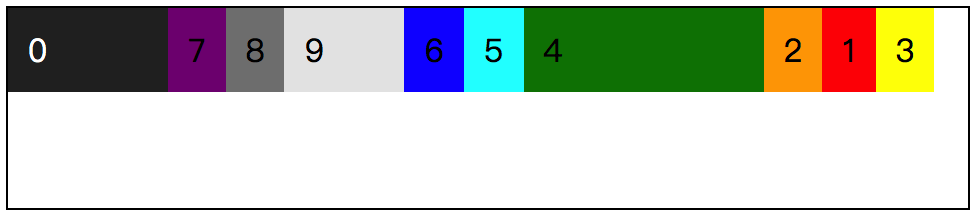

# 📕 flex 元素：order

## align-self 文末思考内容的参考代码


这个主要也就是把 `align-self` 的属性值都写了一遍，具体的大家可以自行进一步感受一下。

```css
/*
  file: flex_0053.css
  align-self 最后小结中的一个思考题
*/
.demo {
  flex-wrap: wrap;
  align-items: flex-start;
  height: 100px;
  /* 在这里给 flex 容器设置了高度 */
  border: 1px solid #000;
}
.item {
  width: 60px;
}
.item:nth-child(n+7) {
  display: none;
}
.item_1 {
  align-self: flex-end;
}
.item_2 {
  align-self: center;
}
.item_3 {
  align-self: flex-start;
}
.item_4 {
  align-self: stretch;
}
.item_5 {
  align-self: baseline;
  font-size: 30px;
}
.item_6 {
  align-self: baseline;
  color: #fff;
}
```


## order 属性的介绍

小时候讲故事的时候，都是会说，很久很久以前。是的，提到这个 `order` 属性，我就想到了很久很久以前，当时大家都在追求 `table` 转 `div`，就是所谓的 **div+css** 布局。为什么会想到这个呢，原因很简单，因为当时是追求着 dom 结构的写法，把关键的重要的部分在 HTML 中先写，然后再写次要的内容信息，最后通过 CSS 去调整布局。

会利用当时觉得很厉害现在很平淡无奇的技术，比如负 margin 、 position 定位之类的各种方式来实现最终想要的页面布局效果。而现在，如果我们使用的是 flex 弹性布局的话，flex 元素想在谁的前面就在谁的前面，而且还一点都不复杂，只需要通过 `order` 属性，并加上相对应的数值就可以了。

### 概述

`order` 属性规定了 flex 元素在 flex 容器中布局时的顺序。在未设置任何 `order` 属性值或者设置了相同的 `order` 属性值时，会以元素在 dom 节点中出现的顺序进行布局；而如果我们修改了 `order` 的属性值，就将会以递增的方式排序，数字越大，flex 元素就排得越后面。

`order` 属性仅仅只是将 flex 元素在页面展示时的视觉效果做了位置的调整，并不会改变其自身在 dom 节点的位置以及顺序。

属性值可以为负值，只要是整数就可以了。


### 示例概述

`order` 的理解相对简单很多，就是看哪个数值大，越大越往后排就好了。就比如下面这个 demo 中的 **item_3** 的样式是 `order: 3;` 比如何一个 **item** 的值都要大，所以在效果图是排到最后的，而 **item_0** 的值是 `-1`，最小，因此排在所有元素的前面。

```css
/*
  file: flex_0054.css
  order 的效果演示
*/
.demo {
  flex-wrap: wrap;
  align-items: flex-start;
  height: 100px;
  /* 在这里给 flex 容器设置了高度 */
  border: 1px solid #000;
}
.item_1 {
  order: 6;
}
.item_2 {
  order: 5;
}
.item_3 {
  order: 114;
}
.item_4 {
  order: 3;
  width: 100px;
}
.item_5 {
  order: 2;
}
.item_6 {
  order: 1;
}
.item_9 {
  order: 0;
  width: 40px;
}
.item_0 {
  order: -1;
  width: 60px;
  color: #fff;
}
```



是的，这就是一个很简单的属性，但是对于页面布局来说还是比较有用的，相对于那些经常需要改变页面元素位置的站点而言。比如当用户拖动一个模块到页面最前面，我们只要把 `order` 改为最小的一个值就可以实现了，不需要去修改 dom 节点或者计算每个模块的位置。

