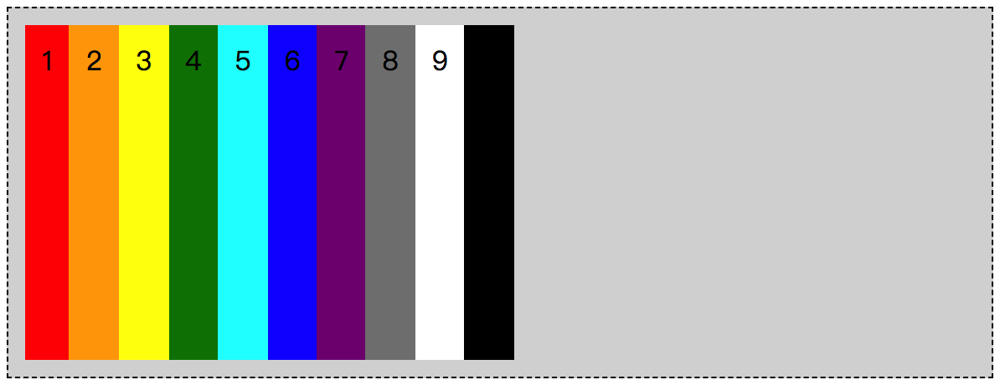
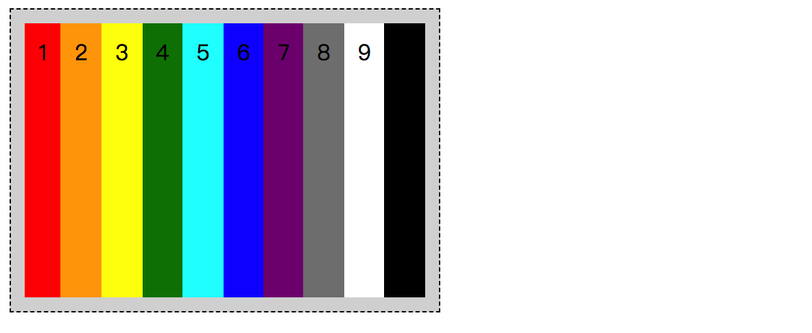
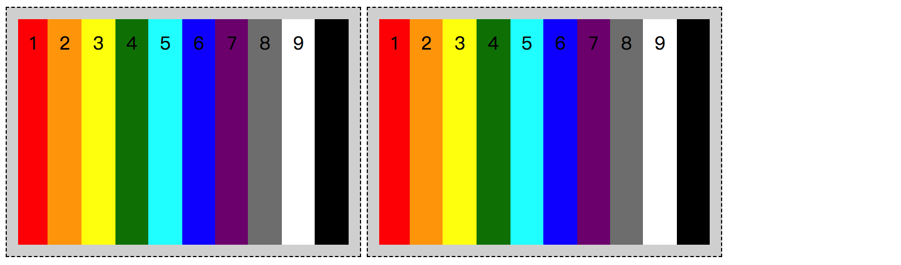
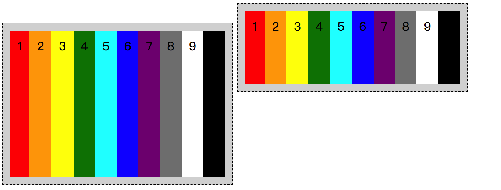
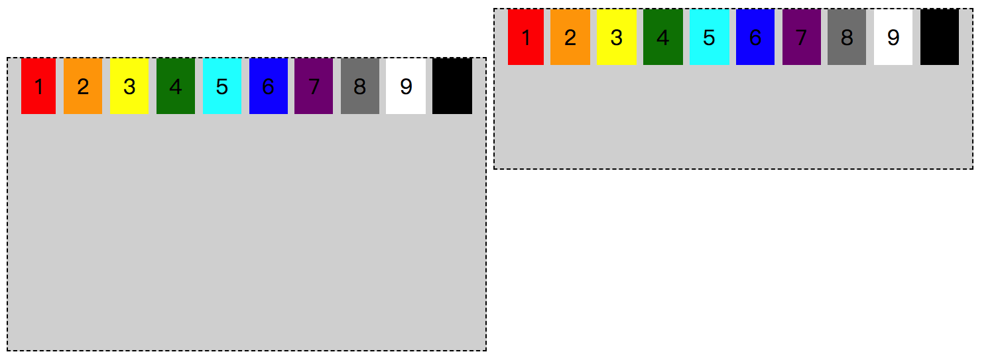
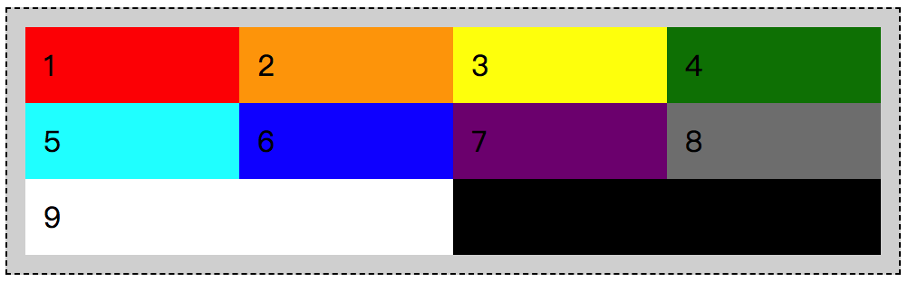
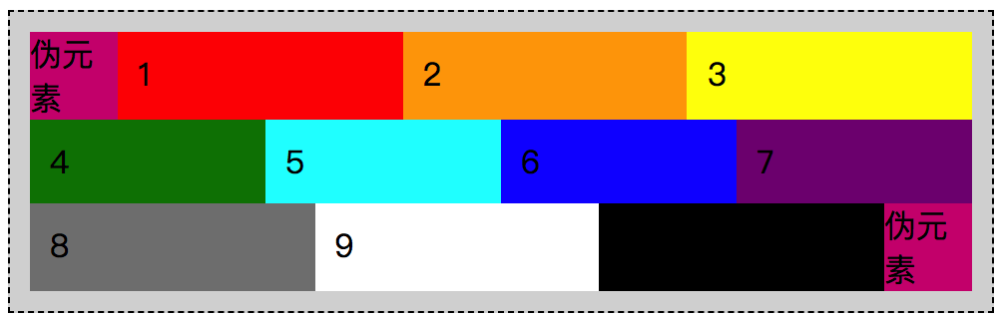

## 初见 display: flex;

其实大家对于 `display` 属性并不陌生，并且也都是一直在使用，比如 `display: block;` 等，但这里我们所要说的是在 flex 弹性布局中所用到的：

- `display: flex;` 
- `display: inline-flex;` 

无论我们将 `display` 的属性值设置为 `flex` 还是 `inline-flex` ，都会将其自身转为 flex 容器，同时该元素的直系子元素将直接转为 flex 元素。在 CSS 中的，所有的属性都是有默认的属性值，当 flex 容器和 flex 元素创建之后，也就代表这个 flex 容器下的所有 flex 元素会拥有以下特性：

* 元素排列成一行；
* 元素从主轴的“起始线”开始排列；
* 元素会被拉伸来填充交叉轴的大小；
* 元素不会在主轴上被拉伸，但是会缩小到自身内容所能容下的尺寸；

以上只是从表面情况而看到的现象，其实在浏览器中对于每个 HTML 元素都是有相对应的一些 CSS 属性值，而当我们把某个父级元素的 `display` 特性改变之后，随之也就影响了其子元素的一些特性。在 flex 弹性布局中，我们所改变的父级元素转变为 flex 容器，其直系子元素则转为 flex 元素。因此，在 flex 容器中的所具有的 flex 属性也就产生了作用，得到的结果也就是我们在浏览器中所看到的效果。

🌰 简单举个例子：

> 我们已知 `.demo` 中已经设置了 `display: flex;` 属性，那么这个时候 flex 容器所包含的 10 个 flex 元素都已经是触发了前面我们说提到的特性。因此，我们给 `.demo` 增加点样式，便于更好识别。
>
> * 有高度，那么 flex 元素就会随着“交叉轴”而拉伸；
> * 无宽度，那么 `.demo` 的宽度就是浏览器的可见区域宽度；
> * 添加 `padding` 可透出背景色，同时与边框产生间距，便于我们更容易识别；

```css
/* 
  file: flex_0001.css
  为了能够更好地体现 flex 元素在 flex 容器中的默认变化，
  我们添加高度以及内间距，同时增加边框和背景色，
*/
.demo {
  height: 200px;
  padding: 10px;
  background-color: #d8d8d8;
  border: 1px dashed #000;
}
```

那么最终的效果就是这样了，与前面提到的表现形式是完全匹配的。



## 再看 display: inline-flex;

现在我们看到的是 `display: flex;` 的一个表现结果，在前面提到过，`display` 在 flex 弹性布局中有两个属性值，那么还有一个 `inline-flex` 的属性值，会有什么表现效果呢？

```css
/* 
  file: flex_0002.css
  改变 .demo 的 display 属性值为 inline-flex
*/
.demo {
  display: inline-flex;
  height: 200px;
  padding: 10px;
  background-color: #d8d8d8;
  border: 1px dashed #000;
}
```

在 CSS 代码中可以看到，我们现在只是比之前多了一句 `display: inline-flex;`，也就是说我们把 demo 中默认的 `display` 属性值改变了，现在看到的页面效果会怎么样呢？



很明显可以感到两者的差异。当使用了 `inline-flex`后，就犹如我们使用了 `inline-block` 一样，不再是占据满满的一栏了，而是随着内容实际尺寸来改变。假如这个时候我们有两个 `.demo` 的 flex 容器，并且浏览器的宽度足够容纳得下，那么我们可以看到的效果就是这样了。



看着感觉既然那么像 `inline-block` 的表现，那么我们可以试着改变一下第二个 flex 容器的高度，然后再改变一下对齐方式会怎么样呢？

```css
.demo + .demo {
  height: 100px;
  vertical-align: middle;
}
```

改变了第二个 `.demo` 的高度，然后再改变 `vertical-align` 的值，最后我们得到的结果就会是这样了：



从这结果来看，这两个 .demo 的对齐方式已经产生变化了，就跟 `inline-block` 的两个元素对齐方式相似，我们可以通过改变 `vertical-align` 的值观察两个元素的变化，再结合同一个 HTML 结构中 `inline-block` 的布局结果进行对比。

```css
.demo {
  display: inline-block;
}
.item {
  display: inline;
}
```



除了内部的子元素表现结果不同，其他的目前是没看到差异。所以，对于 `inline-flex` 这个属性值，我们可以这么理解：**它是一个可以创建 flex 弹性布局的，且类似于 `inline-block` 的属性值**。

虽然我们现在是大概了解了 `inline-flex` 这个属性值，但是在目前实际项目运用中，很少会有人去考虑使用这个属性值，而是更多地在 HTML 中嵌套一层，定义为 `display: flex;` 后再通过 flex 弹性布局的对齐方式来操作。感觉上是绕了一个弯路来实现了一个效果，但是条条道路通罗马，在 CSS 的世界中，一个页面布局效果可能会有 N 中实现方式。如何选择一种相对于当前项目相对较为合适的方式，这个是需要通过不断摸索总结，无法通过三言两语来描述。

## display 后 flex 元素的数量

我们选择使用 `display: flex;` 还是 `display: inline-flex;` ，就好像我们在选择使用 `display: block;` 还是 `display: inline-block;` 一样，这都不是关键，反正可以很明确的一点就是，无论是 `flex` 还是 `inline-flex`，最终都是创建了 flex 容器，有了 flex 弹性布局的特性。

前面提到，当创建了 flex 容器之后，其直系子元素都将是 flex 元素，那么按照我们约定的 Demo 的 HTML 结构来看，仅仅只有这 10 个 div 标签是 flex 元素吗？如果，你的答案是肯定，仅仅只有这 10 个 flex 元素的话，那么，我想说，难道你们忘了 `::before` 和 `::after` 这两个伪元素了吗？

先不要急着否定哦，虽然这两个伪元素是需要通过 CSS 去“激活”的，但并不能否认这两个伪元素的存在，对吧？

为什么要提到这两个伪元素呢？

这是因为现在很多人都会去使用 iconfont 方式插入 icon，那么使用 iconfont 方式插入 icon 的话，是不是就先去考虑 `::before` 和 `::after` 这两个伪元素？如果考虑了，也就是要去“激活”伪元素了，最终不也就是多了一个 flex 元素了？

多了一个 flex 元素又能怎么样呢？

其实并不会怎么样，只是可能会影响到你的页面布局。在 flex 弹性布局时，仅仅只有一行可能不会有太多感受，但是有多行的话，情况就会有所不同了。

```css
/* 
  file: flex_0003.css
  未激活伪元素之前的多行 flex 弹性布局
*/
.demo {
  flex-wrap: wrap;
  padding: 10px;
  background-color: #d8d8d8;
  border: 1px dashed #000;
}
.item {
  flex: 1 1 20%;
}
```

在未将伪元素内容提出来之前，我们现在看到的页面布局结构是这样的：



```css
/* 
  file: flex_0004.css
  添加伪元素之后的多行 flex 弹性布局
*/
.demo {
  flex-wrap: wrap;
  padding: 10px;
  background-color: #d8d8d8;
  border: 1px dashed #000;
}
.item {
  flex: 1 1 20%;
}
.demo::before,
.demo::after {
  content: '伪元素';
  width: 20px;
  height: 20px;
  background-color: #cf197d;
}
```

在之前的基础上，我们把伪元素提出来，那么情况就变了。至少新增的伪元素是不会有之前我们设定的 `.item` 的样式，除非重新定义一次。所以，最终得到的结果就是下图所示的样子了，如果说这个时候你的伪元素是用来放 icon 的，可能需要定义大量的样式去覆盖。



这种情况也不是说没有办法解决，只要脱离了文档流就可以了不用受到 flex 弹性布局的影响了，所以，我们可以使用 `position: absolute;` 的方式来解决。当然啦，具体问题具体分析，还是要根据实际的使用场景来处理，现在只是跟大家提一下，当你的 `display` 属性值是 `flex` 或者 `inline-flex` 的时候，不要忘记伪元素也是 flex 容器的直系子元素，也是 flex 元素。