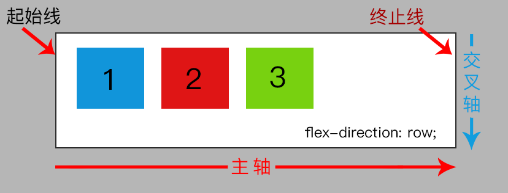

在 flex 弹性布局的时候，我们可能会对 flex 元素的排列位置有要求，比如从左到右，从下到上这类非常规的布局方向需求，那么 `flex-direction` 就能够很容易帮助我们实现。前面提到的“主轴”和“交叉轴”，以及提到“起始线”和“终止线”的时候，`flex-direction` 在这几个的变化中起到决定性的作用。

简单来说，`flex-direction` 属性将会定义 flex 弹性布局中“主轴”的方向，从而影响着 flex 元素如何在 flex 容器内的布局。其主要的属性值有：

* `row` 
* `row-reverse` 
* `column`
* `column-reverse`

四个值改变着“主轴”的位置，也同时改变着“起始线”的位置，最终影响着 flex 元素的布局结果。

## row 与 row-reverse

`row` 顾名思义，就是“行”。一行两行的行，那也就代表着当使用 `flex-direction: row;` 的时候，flex 元素的将一行排列方式展示。因为 `row` 是 `flex-direction` 的默认值，所以，在前面我们所看的 demo 的初始效果就是了。


```css
/* 
  file: flex_0005.css
  flex-direction: row 时 flex 元素的排列效果
*/
.demo {
  flex-direction: row;
}
```

同时，这个时候我们需要知道“主轴”和“起始线”的位置。在前面我们已经提到过，“主轴”的方向，“起始线”的位置是与 `flex-direction` 的值息息相关的。那么这个时候我们所能得到的结果其实就是这样：



所以当我们选择使用 `row-reverse` 方向的行时，得到的结果就是：


```css
/* 
  file: flex_0006.css
  flex-direction: row-reverse 时 flex 元素的排列效果
*/
.demo {
  flex-direction: row-reverse;
}
```

很明显可以看到 flex 元素的位置发生了变化，都反过来了，第一个元素显示在 flex 容器的最右侧。那么这个时候的“主轴”和“起始线”会是什么位置呢？还是跟 `flex-direction: row;` 的结果一样吗？答案很显然，`row` 和 `row-reverse` 是相反的一个操作，所以，此时的“主轴”和“起始线”就是这样了：


`row` 与 `row-reverse` 对于“主轴”而言，其实就是行，也就是说，当使用的是 **row** 时，X 坐标的轴线就是“主轴”，相对的，“交叉轴”一直都是以 Y 坐标的形式存在着。而 **reverse** 的出现则是影响了“起始线”与“终止线”的位置，如果仅仅只是 `row` 的话，“起始线”的位置就是当前语言环境下的阅读顺序，反之，使用了 `row-reverse` 就会得到相反的结果。

这里提到当前语言环境下的阅读顺序，一般我们的阅读浏览顺序是从左往右，从上到下。假如我们人为修改这个顺序方向，那么对于“起始线”和“终止线”是否会有影响呢？

```css
/* 
  file: flex_0007.css
  修改 direction 的值，改变阅读顺序
*/
.demo {
  flex-direction: row;
  direction: rtl;
}
```

当我们在 `flex-direction: row;` 的情况下通过 `direction` 改变了方向之后，得到的结果就跟我们使用 `flex-direction: row-reverse;` 是一样的。所以，flex 布局中的“起始线”还跟 `direction` 的值是有关系的，并不仅仅只是看 `flex-direction` 的值。

## column 与 column-reverse

了解了 `row` 之后，我们再看看 `column`。`row` 指的是行，那么 `column` 指的肯定就是列了。所以，当我们想要得到这样的一个页面布局效果时，只要改变 `flex-direction` 的值就可以了。


```css
/* 
  file: flex_0008.css
  flex-direction: column; 时的页面布局效果。
*/
.demo {
  flex-direction: column;
}
```

从页面截图来看，现在 flex 元素是从上至下的排列，一个 flex 元素占据一行。从这里我们也就可以发现，“主轴”发生了变化，而且“起始线”与“终止线”也变了。


同理，当我们使用 `flex-direction: column-reverse;` 时，得到的 flex 布局结果就是反了个方向的。


```css
/* 
  file: flex_0009.css
  flex-direction: column-reverse; 时的页面布局效果。
*/
.demo {
  flex-direction: column-reverse;
}
```

一个元素的高度并不想宽度一样会自动撑满屏幕，所以，在默认情况下，当我们使用 `row-reverse` 属性值时，flex 元素会从浏览器边缘部分开始；而当我们使用 `column-reverse` 时，并不是从浏览器的最底下开始，除非当前的 flex 容器高度与浏览器可视区相同高度。简而言之，`column-reverse` 是从 flex 容器的底部开始向上排列，是的，就是从下往上的一个布局。

因此，当使用 `column-reverse` 时的“主轴”与“起始线”等情况就是这样了：


当 `flex-direction` 的值是 `column` 或者 `column-reverse` 时，`direction` 属性就不再会影响 flex 元素的排列了，而只是让改变了 flex 元素中文字的显示方向。


```css
/* 
  file: flex_0010.css
  flex-direction: column; 时，添加 direction: rtl; 的页面效果。
*/
.demo {
  flex-direction: column;
  direction: rtl;
}
```

## 属性之间……

在 CSS 的世界中，每个属性都有各自的作用，而多个属性结合的时候，得到的结果可能是想冲突的，就好比 `flex-direction: row;` 与 `direction: rlt;` 共存时；而有的时候却并不会，就像 `flex-direction: column;` 与 `direction: rtl;` 共存时。

但这些只是表面现象而已，只要我们明白了 `flex-direction` 与 `direction` 这两个 **direction** 所影响的元素是哪些，那么也就能明白如何利用好这两个属性了。在众多的 CSS 属性中，影响页面阅读方向、元素排列方向的并不只是这么两个带有 **direction** 单词的元素，这里就不再继续展开，在后续的章节中会通过相关的 demo 与大家一起共同了解。

通过这章节我们主要了解的是 `flex-direction` 属性，对于该属性，我们需要了解当使用不同的属性值时，对于 flex 布局中的“主轴”、“起始线”等特性是会产生变化的。而“主轴”与“起始线”的变化，最终将会影响到 flex 元素的排列对齐方式，也就是后面我们会介绍的几个有关 flex 元素对齐的属性。

* x 坐标轴是“主轴”，`flex-direction` 的值是 **row** 相关的；反之就是 **column**；
* 第一个 flex 元素哪边靠 flex 容器边缘，哪边就有可能是“起始线”，具体在哪边，还要看“主轴”；

