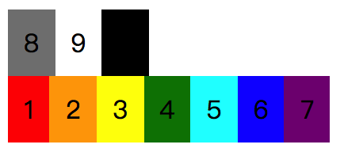
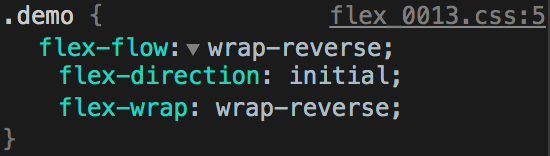
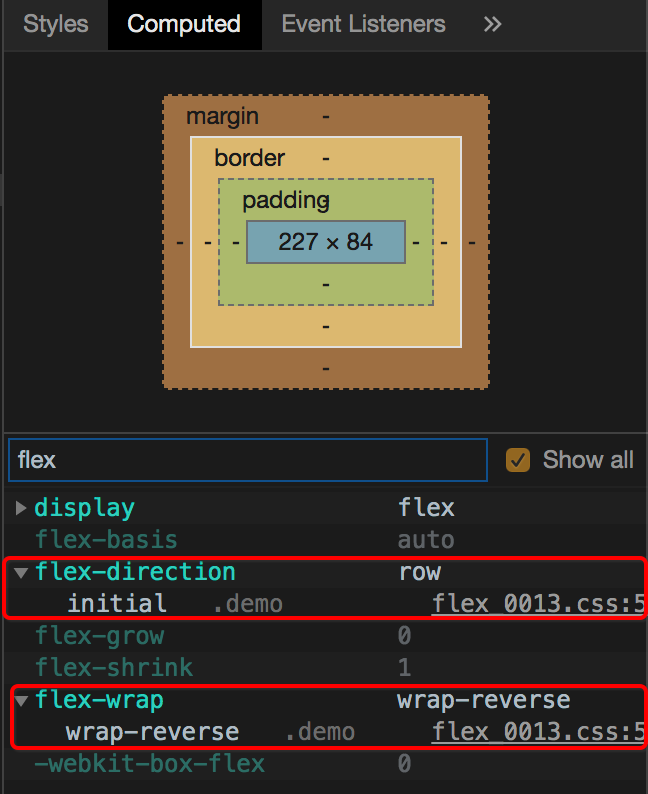
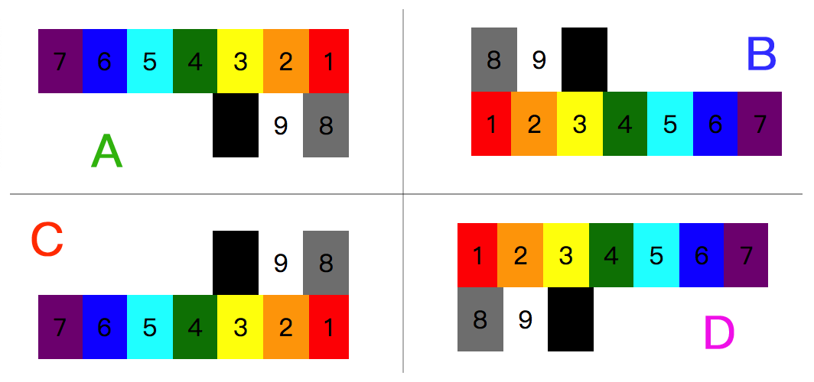

在前面我们了解了 `flex-direction` 与 `flex-wrap` 这两个属性，在这两个属性的介绍中，也都提到了“主轴”与“交叉轴”、“起始线”与“终止线”的变化。而这“轴”与这“线”的位置变化，关键因素就是 flex 元素在其容器中方向的变化。flex 元素从哪个位置开始，流向哪个位置，最终影响了“轴”与“线”在这个 flex 容器中的定义。

或许也就是因为 `flex-direction` 与 `flex-wrap` 是直接影响着 flex 元素的流向改变，所以，在诸多的 flex 属性中，有个将这两个属性简写的 `flex-flow` 属性存在。

`flex-flow` 只是一个简写，因此她自身的属性值就是 `flex-direction` 与 `flex-wrap` 的属性值，默认值也是如此。并且这两个属性的属性值都是很有特色，一眼就能看出来，所以在 `flex-flow` 中不需要考虑前后顺序问题，甚至仅仅只是写一个属性也无所谓，另外一个会采用默认值来补充。

```css
/* 
  file: flex_0013.css
  flex-flow: wrap-reverse; 等效于 flex-wrap: wrap-reverse;；
*/
.demo {
  flex-flow: wrap-reverse;
}
```

这是一个很简单的例子，当我们使用 `flex-flow: wrap-reverse;` 时，其实是定义了两个属性，分别是：

* `flex-wrap: wrap-reverse;`
* `flex-direction: row;`

虽然我们没有写明 `flex-direction` 的值，但浏览器会自动采用默认值 `row` 作为该属性值，所以最终在浏览器中的表现效果是这样的：



在浏览器的开发者工具（DevTools）中，我们可以通过 **Elements** 面板中的 **Styles** 部分看到 `flex-flow` 展开后的情况，其中 `flex-direction` 的值是 `initial`。



初始值，也就是 `row`，我们可以通过 **Computed** 中找到最终解析后的 `flex-direction` 的值。



假如我们定义的属性是 `flex-flow: column;` 的话，得到的结果会是什么呢？很显然，`flex-wrap` 就会变成 `initial` 了。如果 `flex-flow: column wrap;` 的话，那就没有 `initial`，而是具体的属性值了。



看到上面这张图，如果是让我们用 `flex-flow` 属性来实现的话，分别应该是什么呢？不要感觉混乱，其实就是不同方向的 `row` 以及 `wrap` 而实现的。

* A：`flex-flow: wrap row-reverse;`
* B：`flex-flow: wrap-reverse;`
* C：`flex-flow: wrap-reverse row-reverse;`
* D：`flex-flow: wrap;`

