# 📕 flex 容器：justify-content

在前面我们所看到的 demo 中，所有的 flex 元素都是规规矩矩，一个接一个的排列着的，最多也就是排列的方向有所不同。而影响这个排列方向的主要原因就是前面提到的“主轴”和“交叉轴”的概念。在这个“轴”所在的空间区域中，不仅仅是影响着 flex 元素排列方向，更关键的是还会影响着每个 flex 元素的对齐方式。

`justify-content` 属性用于指定项目在“主轴”上的对齐方式。那么这个“主轴”也就是看 `flex-direction` 是怎么定义的了。

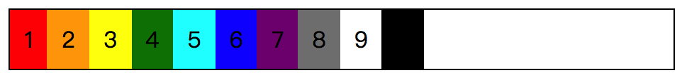

首先我们在没有增加 `justify-content` 属性的时候，看到默认的效果是从左边开始的，也就是说这个时候的“主轴”是 x 坐标，“起始线”是在左边。

```css
/* 
  file: flex_0014.css
  justify-content: center; 在 flex-direction 的默认值情况下的表现效果
*/
.demo {
  justify-content: center;
  /* 为了便于更好地看清 flex 元素的改变，加个边框来增强效果 */
  border: 1px solid #000;
}
```

简单的增加一个 `justify-content: center;` 之后，得到的效果是从“主轴”的中间开始向两边扩散。

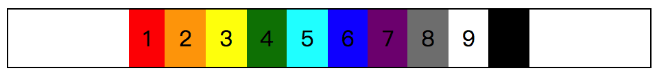

而如果我们改变了“主轴”的方向，也就是当我们把 `flex-direction` 的值改变之后，`justify-content` 的对齐方向也将会改变。

```css
/* 
  file: flex_0015.css
  justify-content: center; 在 flex-direction 的值为 column 情况下的表现效果
*/
.demo {
  justify-content: center;
  /* 为了便于更好地看清 flex 元素的改变，加个边框来增强效果 */
  border: 1px solid #000;
  /* 改变 flex-direction 的值 */
  flex-direction: column;
  /* 为了更好地查看根据主轴方向的对齐，增加一个高度值 */
  height: 600px;
}
```

这里如果没有 `height` 的话，flex 容器会被 flex 元素撑开，无法体现这个对齐效果。

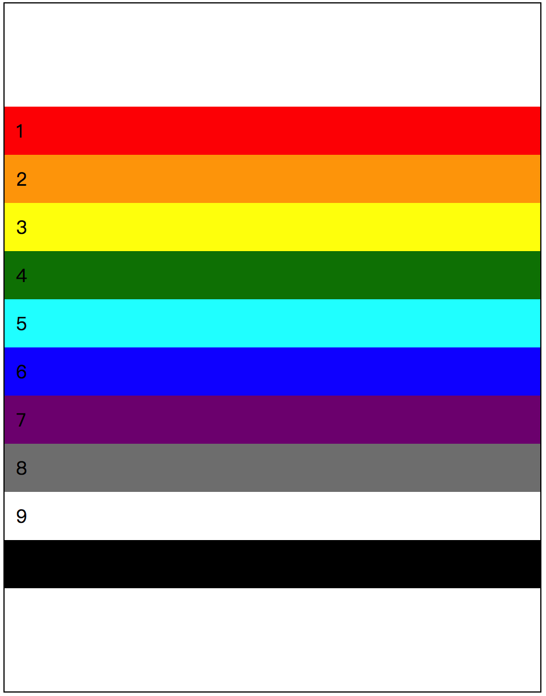

为了能更好地感受一下这个根据“主轴”而居中对齐的效果，我们可以通过开发者工具（DevTools）直接删除 HTML 节点来看看效果。

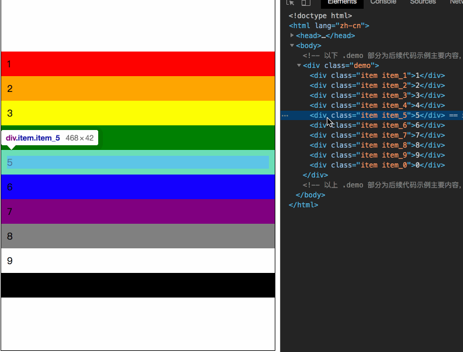

## 属性值列表

在 `justify-content` 对齐的方式中，`center` 是其中的一个值，在 flex 布局中所包含的属性值有：`flex-start`、`flex-end`、`center`、`space-around`、`space-between` 以及 `space-evenly` 这六个值。

### flex-start

从“主轴”的**行首**开始排列，每行第一个元素与行首对齐，后续所有的元素与前一个元素对齐。

```css
/* 
  file: flex_0016.css
  justify-content: flex-start; 的对齐效果
*/
.demo {
  justify-content: flex-start;
  /* 让 flex 元素换行，观察元素多行情况下的对齐 */
  flex-wrap: wrap;
  /* 为了便于更好地看清 flex 元素的改变，加个边框来增强效果 */
  border: 1px solid #000;
}
/* 让每个元素都有一个宽度，加强对齐效果视觉差 */
.item {
  width: 60px;
}
```

说再多不如直接来 demo 看效果。在这个 demo 中，关键的就是 `justify-content: flex-start;`，其他的属性都是辅助，在代码中已经添加了简单的介绍。具体的效果很直观。

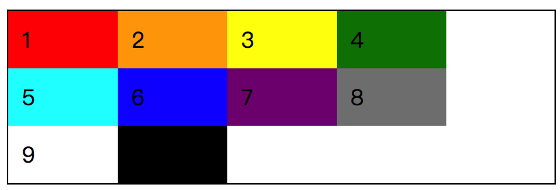

再结合 `flex-direction` 对“主轴”和“起始线”的影响，现在我们这个默认情况下的表现是：

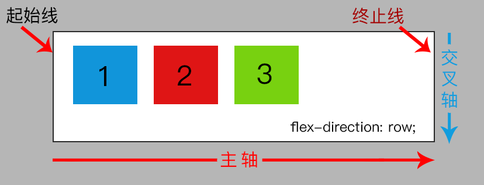

因此，当我们把 flex 元素的节点不断删除，会看到每个元素的改变位置都是向“起始线”方向移动，并且都是往第一行的方向移动。

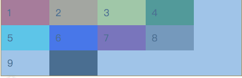

### flex-end

从“主轴”的**行尾**开始排列，每行最后一个元素与行尾对齐，后续所有的元素与前一个元素对齐。

从这个定义来看，`flex-end` 在对齐的关键因素点就是向**行尾**靠拢，因此当我们定义了 `justify-content: flex-end;` 后，所得到的效果就是下图这样了。

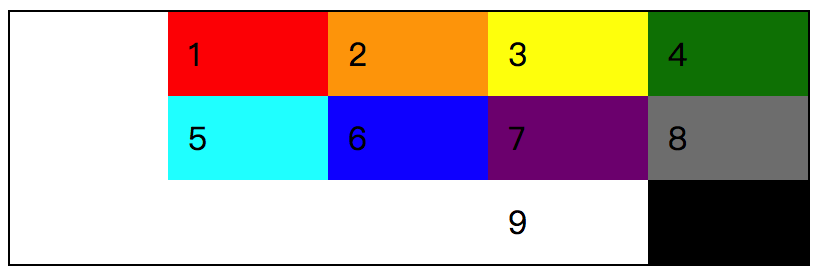

从结果来看，与 `flex-start` 是相反的方向，而如果按照对齐的原则来看的话，其实也是一样的，每行的最后一个元素会与**行尾**对齐。如果想要简单粗暴地理解呢，那就直接认为是右对齐就可以了。

### center

从“主轴”的**中间**开始排列，每行第一个元素到行首的距离与每行最后一个元素到行尾的距离是相等的。在前面我们也知道 flex 元素一行排列的时候，`justify-content: center;` 的表现结果是怎么样的。现在我们这个在多行的情况下，表现的结果是怎么样呢？

其实效果也就是前面看的那样，没什么区别，无非就是多行都是水平居中的表现而已。

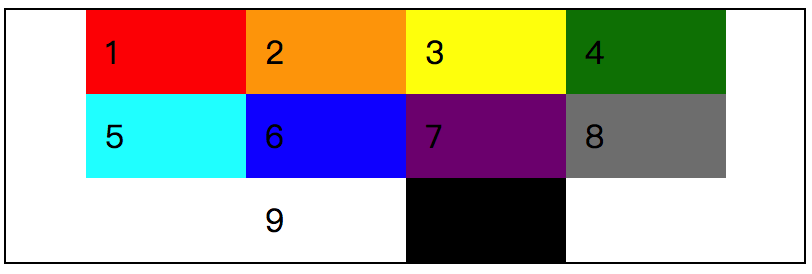

如果删掉几个节点的话，得到的结果就是：由于 flex 容器的宽度问题，一行最多就是放 4 个，但无论是一行有几个 flex 元素，都是居中显示。

### space-between

* 在每行上均匀分配每个 flex 元素，相邻元素的间距也是相同的；
* 每行第一个元素与行首对齐，最后一个元素与行尾对齐；

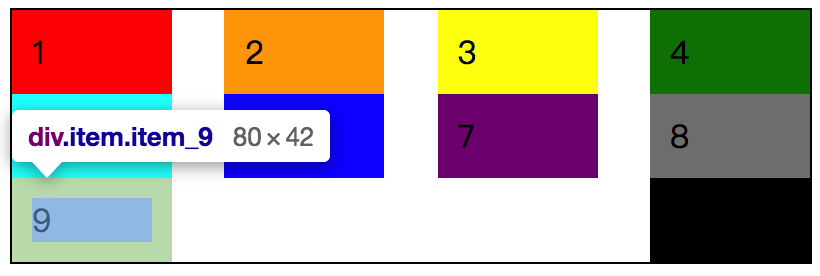

按照图中所示效果，每行首尾对齐以及每个元素的间距是相同的。这里我们做一个简单的假设，比如第 6 个元素的宽度很大，那么 flex 元素的布局表现会是怎么样的呢。

```css
/* 
  file: flex_0017.css
  justify-content: space-between; 的对齐效果
*/
.demo {
  justify-content: space-between;
  flex-wrap: wrap;
  border: 1px solid #000;
}
.item {
  width: 60px;
}
/* 让第 6 个 flex 元素的宽度 变大，看看布局效果的变化。 */
.item_6 {
  width: 200px;
}
```

很显然，这个时候我们肯定是知道第 6 个元素的宽度变大了，如果第 8 个元素放不下的话，就会到下一行。那么对齐方式是不是会保持元素之间的间隔相同呢？

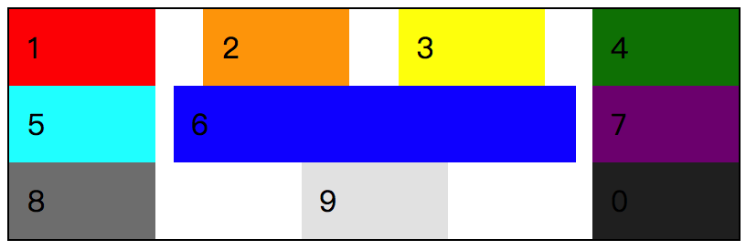

是的，按照这个属性的介绍，完全符合情况。那么如果第 6 个元素的宽度继续变大，`width: 350px;` 的话，会是怎么样的一个效果呢？结果就是 flex 元素四行展示，5 和 6 这两个元素会独占一行，因为第 6 个元素宽度过大，无法在其周围容纳第二个相邻元素了。

一行只有一个元素，也就只能紧跟行首而已，所谓的间距就暂时与其无关了。

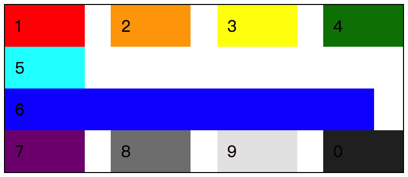

### space-around

* 在每行上均匀分配每个 flex 元素，相邻元素的间距也是相同的；
* 每一行的第一个元素与行首之间的距离是 flex 元素之间距离的一半，每一行最后一个元素与行尾的距离也是 flex 元素之间距离的一半；

从这里的描述来看，`space-around` 与 `space-between` 是极为相似的效果，区别仅在行首以及行尾与 flex 元素的间距。按照属性值的描述，修改 **flex_0017** 这个 demo 的 `justify-content` 属性值，我们可以看到效果是这样的：

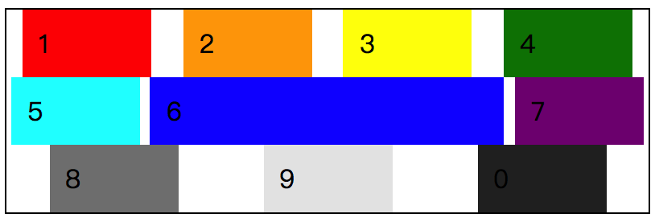

```css
/* 
  file: flex_0018.css
  justify-content: space-around; 的对齐效果
*/
.demo {
  justify-content: space-around;
  /* 相对 flex_0017 demo，仅仅只是修改了 justify-content 的属性值  */
...
```

从效果截图来看，行首与行尾与 flex 元素之间的间距的确是 flex 元素相互之间的间距一半。

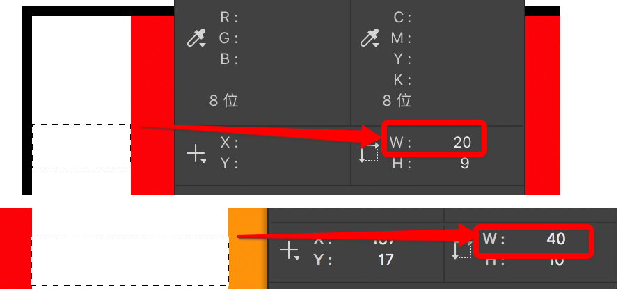

虽然这截图对比没什么必要，通过 demo 的效果图我们大概也是能够看到他们之间的间距差别。以属性值的描述文案来分析，与 `space-between` 的差别是行首、行尾与 flex 元素之间的间距，所以，假如我们把第 6 个元素的宽度值变得很大，那么最终的结果也就是该元素独占一行；如果宽度值变小，结果就是与其他 flex 元素均分。

### space-evenly

* 在每行上均匀分配每个 flex 元素，相邻元素的间距也是相同的；
* 每一行的行首与第一个 flex 元素的间距是与 flex 元素之间间距相同的，行尾与最后一个 flex 元素的间距也是如此；

这是 `justify-content` 属性值中最后一个带有 **space** 字样的属性值了，与上述的 `space-between` 以及 `space-around` 结合来看，现在这个 `space-evenly` 在行首、行尾与 flex 元素之间的间距又有改变了，我们先通过一个 demo 结合属性值描述看一下效果。

```css
/* 
  file: flex_0019.css
  justify-content: space-evenly; 的对齐效果
*/
.demo {
  justify-content: space-evenly;
  /* 相对 flex_0018 demo，仅仅只是修改了 justify-content 的属性值  */
...
```

同样是只是修改了属性值，页面效果为：


不仔细看，似乎并没有什么差别，但是如果细看的话，可以发现行首、行尾以及 flex 元素之间的间距都是相同的，无论 flex 元素自身的宽度如何，间距是保持相同的。所以，对于这三个 **space-*** 属性值，最大的差别就是：

* `space-between`：行首、行尾与第一个、最后一个 flex 元素之间**无间距**；
* `space-around`：行首、行尾与第一个、最后一个 flex 元素之间的间距是各 flex 元素间距的**一半**；
* `space-evenly`：行首、行尾与第一个、最后一个 flex 元素之间的间距与各 flex 元素间距**相同**；

## 别忘了“主轴”

如果仅仅只是介绍 `juestify-content` 属性值的话，那么应该算完成了，但是，在前面我们说过，flex 布局中“轴”的概念很关键，是影响着 flex 元素对齐以及 flex 布局的重要因素之一。在 `justify-content` 中所提到的“主轴”都是以默认值 `flex-driection: row;` 来看效果的。那么如果我们改变了“主轴”的位置，得到的结果将会是怎么样的呢？

这里所说的修改的 `flex-direction` 的值，主要是 `row` 和 `column` 的变化，毕竟 `row` 和 `row-reverse` 的变化不会有太大区别。

```css
/* 
  file: flex_0020.css
  justify-content 在改变“主轴”后的变化
*/
.demo {
  flex-direction: column;
  /* 改变 flex-direction 的值为 column */
  justify-content: space-evenly;
  /* 相对于 flex_0019 demo，改变了 flex-direction 的值 */
...
```

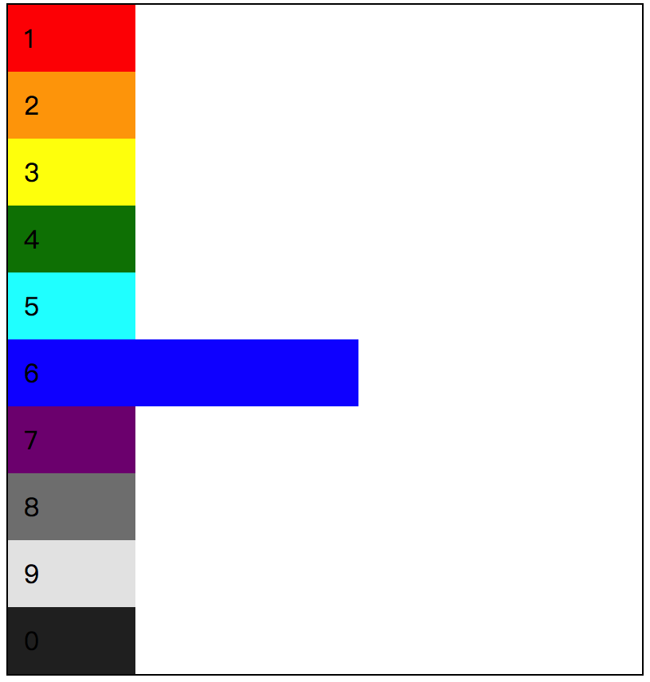

很显然，“主轴”现在是在 Y 坐标上，所以，我们看到的布局效果是从上往下一行一个 flex 元素的排列。以至于 `justify-content` 没有任何效果。那么是真的没有任何效果吗？

其实并不是的，效果肯定是有的，或许是我们忘了在这个布局的效果中，目前的 flex 元素在 flex 容器是否有足够的空间可以容纳得下呢？flex 容器的高度会被 flex 元素撑开，页面的高度会被 flex 容器撑开，最终我们看到的结果永远都是一行一个。

可如果我们给 `.demo` 这个 flex 容器加上一个 `height` 高度值，会是什么效果呢？

```css
/* 
  file: flex_0021.css
  justify-content 在改变“主轴”后，并给 flex 容器增加 height 后的变化；
*/
.demo {
  height: 200px;
  /* 相对于 flex_0020 demo，增加一个 height 值 */
...
```

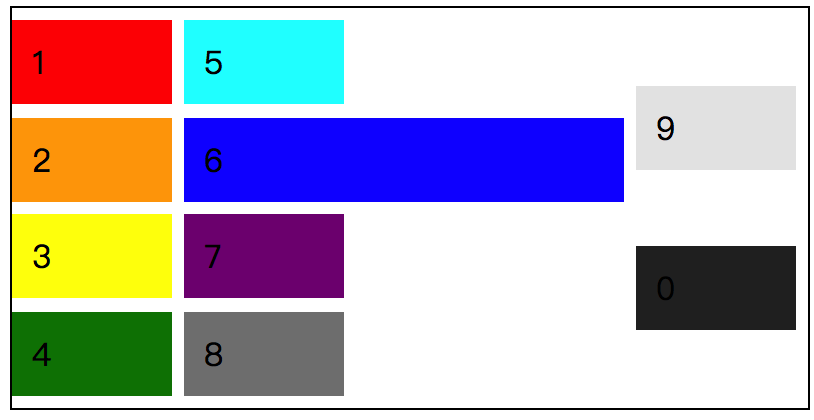

现在我们可以看到 `justify-content: space-evenly;` 在 `flex-direction: column;` 时的效果是上下均分 flex 元素之间的间距。

仅仅这样就结束了吗？

还是先看看目前这个 demo 中完整的 CSS 代码，再结合页面效果，可能会有额外的收获。

```css
/* 
  file: flex_0021.css
  justify-content 在改变“主轴”后，并给 flex 容器增加 height 后的变化；
*/
.demo {
  height: 200px;
  /* 相对于 flex_0020 demo，增加一个 height 值 */
  flex-direction: column;
  /* 改变 flex-direction 的值为 column */
  justify-content: space-evenly;
  flex-wrap: wrap;
  border: 1px solid #000;
}
.item {
  width: 60px;
}
/* 让第 6 个 flex 元素的宽度 变大，看看布局效果的变化。 */
.item_6 {
  width: 200px;
}
```

* 当 `flex-direction: column;` 时，flex 容器的高度固定，且 `flex-wrap: wrap;` 的话，flex 元素会沿着“主轴”的位置排列，遇到“终止线”后会换行展示；
  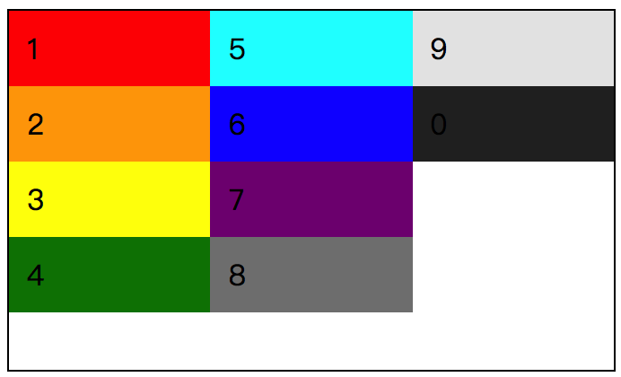
* flex 容器中增加 `justify-content` 对齐方式后，flex 元素的排列方式又将随之改变；改变浏览器的大小，flex 元素也会随之改变自身宽度，但 `justify-content` 的对齐方式不会改变，因为 `flex-direction: column;` 的关系，“主轴”在 Y 坐标，所以 `space-evenly` 均分所得的元素间距是上下间距，于是效果就是这样了：
  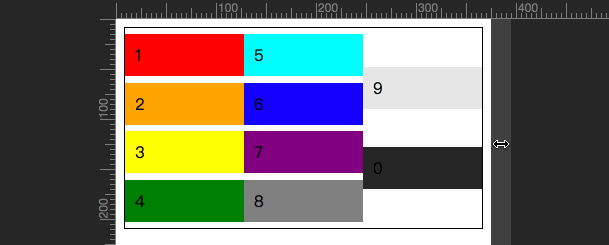
* 而如果给 flex 元素设定了宽高之后，浏览器窗口大小改变所影响的将会是 flex 元素之间的间距；就算是其中某个元素的宽度不同，最终所改变的也只是元素之间的间距而已。但这与 `justify-content` 属性无关，因为“主轴”的位置并不在 X 坐标；
  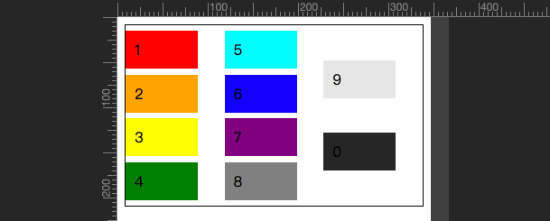

在这里啰嗦这些属性之间的关联，只有一个目的，就是想说明一下，在 flex 弹性布局中，任何一个元素的存在都是具有决定性的意义。这章节中提到的 `justify-content` 属性主要是根据“主轴”的位置去改变 flex 元素之间的对齐方式。

