在前面有关 `justify-content` 的时候，我们提到了给 flex 容器设置一个高度，让以 `column` 方向排列的元素在特定高度内出现“换行”的现象。那么我们再往这个 demo 之前看看，如果我们是以 `row` 方向排列的话，并且设置了一个高度，flex 元素在容器中会是怎么样的一个表现形式呢？

```css
/* 
  file: flex_0022.css
  当 flex-direction 为默认的 row 时，flex 容器高度较大的页面效果；
*/
.demo {
  justify-content: space-evenly;
  flex-wrap: wrap;
  height: 400px;
  /* 在这里给 flex 容器设置了高度 */
```

我们先回顾一下当没有高度的时候，页面中 flex 元素排列布局情况。

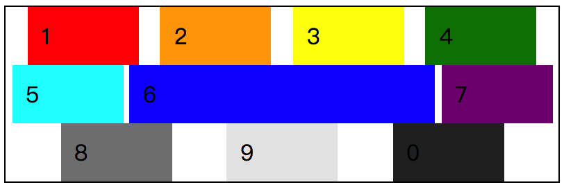

现在我们给 flex 容器增加了高度，而根据 flex 布局的一个特性，“弹”，所以，我们可以看到，浏览器在默认情况下，如果 flex 容器空间足够，flex 元素会拉伸去填充。

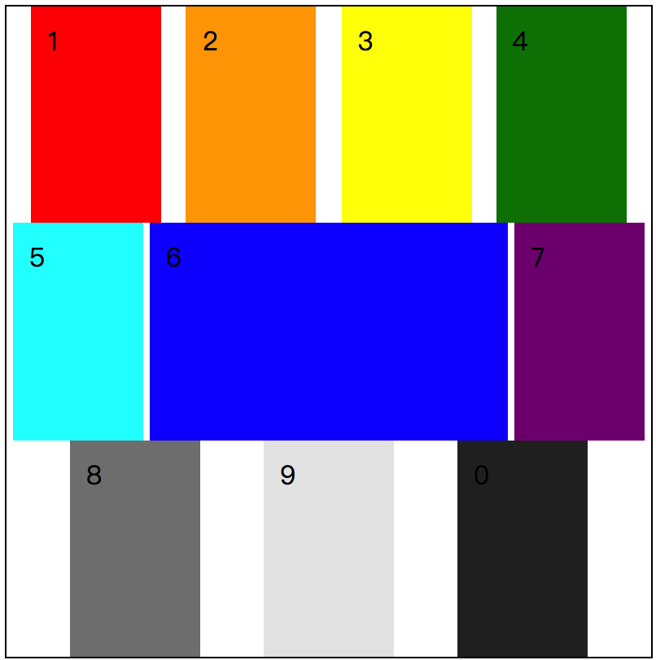

这就是我们接下来要学习的属性：`align-items`，可控制 flex 元素在“交叉轴”方向上的对齐方式。在 flex 弹性布局中，`align-items` 的属性值其实还好，也就下面这么几个：

* `normal` / `stretch`
* `flex-start`
* `flex-end`
* `center`
* `baseline`

## 属性值介绍

简单来说，在 flex 弹性布局中，我们通过 `align-items` 主要是希望控制 flex 元素在交叉轴方向的对齐方式。而对齐方式无非就是顶部、中间、底部，然后 flex 弹性布局中还有就是拉伸以及基线对齐方式。

### normal / stretch

`normal` 作为 `align-items` 的**默认值**，但从效果上来说，与 `stretch` 的是一致的，因此就将这两个放在一起，以 `stretch` 作为属性值来做 demo 展示。是的，刚提到了，`align-items` 的默认值是 `normal`，而 `normal` 的效果又类似于  `stretch`，那么我们可以粗暴地理解最终的效果就是 `stretch` 。

`stretch` 会将 flex 元素拉伸至 flex 容器所能容纳得下的高度/宽度，以交叉轴为方向。简单来说，当 flex 元素未被 `flex-wrap` 设置换行，那么每个 flex 元素的高度都将会与 flex 容器相同。

大概情况可能就是这样了：

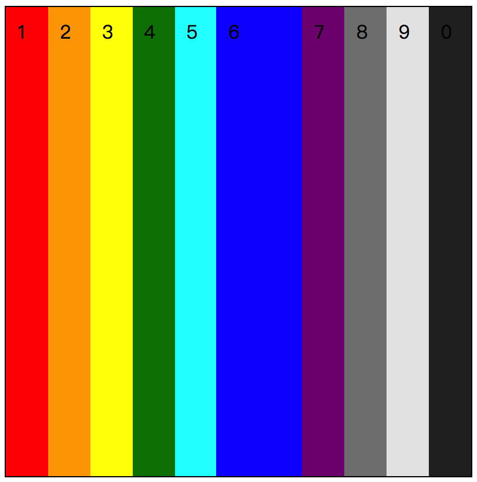

而如果按照我们在文章前面看到的 **demo_0022**，在设置了 flex 容器的高度的基础之上，又设置了 `flex-wrap: wrap;` 的换行处理，最终得到的是在有限的空间中，在交叉轴中，平均合理分配每个 flex 元素的空间（宽高），所以，得到效果是：


需要注意的一点是：`stretch` 是拉伸的，所以，看到每个元素的高度都是拉伸开的，并且这是默认值的情况。按照目前的情况，我们的 `flex-direction` 采用的是默认值 `row`，那么如果我们使用 `column` 会是怎么样的呢？只用 **demo_0022** 这个增加 `flex-direction: column;` 的话，会得到这样的一个情况，并没有没拉伸。

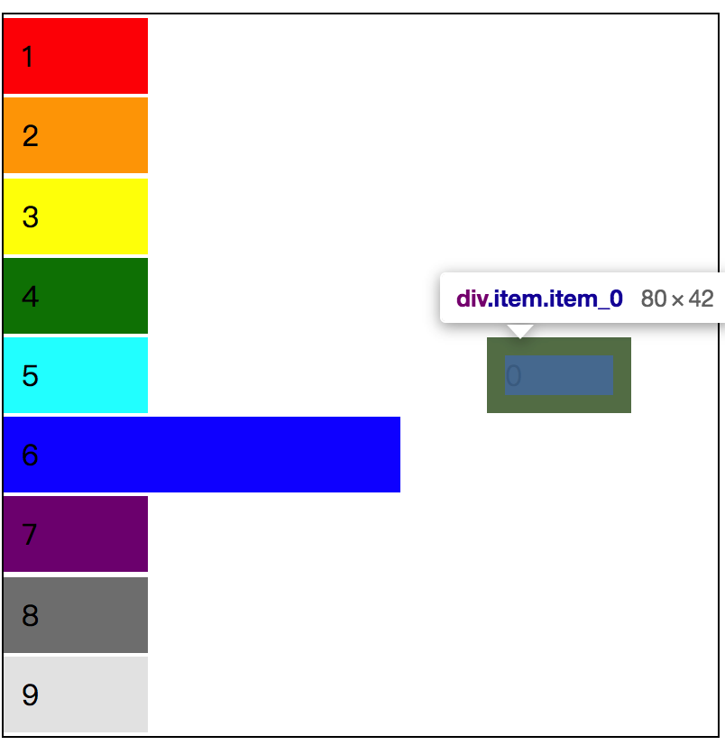

通过 devTools 我们可以看到 flex 元素的宽度其实是 `padding` 和 `width`  的总和，`80px`。所以，我们还是需要把每个 flex 元素的 `width` 删掉才能得到最终想要的效果。

```css
/* 
  file: flex_0023.css
	当 flex-direction 为 column 时，默认的 align-items 的表现结果；
*/
.demo {
  justify-content: space-evenly;
  flex-wrap: wrap;
  height: 400px;
  /* 在这里给 flex 容器设置了高度 */
  border: 1px solid #000;
  flex-direction: column;
}
.item {
  /* width: 60px; */
}
/* 让第 6 个 flex 元素的宽度 变大，看看布局效果的变化。 */
.item_6 {
  /* width: 200px; */
}
```

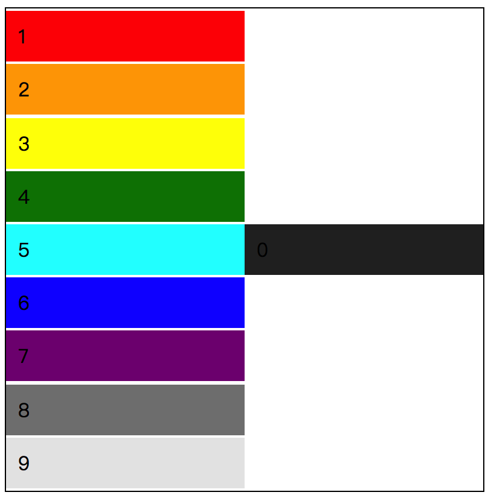

所以，当我们使用的 `flex-direction` 是 `column` 时，其实也就是换了一个方向去拉伸。不过鉴于目前看到拉伸的是宽度，所以，如果有 `width` 的时候，整体效果会受到影响。

### flex-start

`flex-start` 从 **flex** 和 **start** 这两个单词来看就很容易理解了，首先 `align-items` 是控制 flex 元素在交叉轴方向的对齐排列方式，其次这个 start 表明了是从起始线开始的位置对齐。结合这两个条件，那么在我们默认的情况下 flex 元素是在 flex 容器的左上角。

```css
/* 
  file: flex_0024.css
  align-items: flex-start; 在默认情况下的页面表现效果；
*/
.demo {
  align-items: flex-start;
  height: 200px;
  /* 在这里给 flex 容器设置了高度 */
  border: 1px solid #000;
}
```

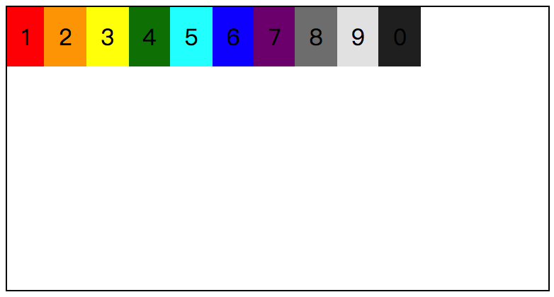

按照前面的 demo 情况，这里我们可以考虑给每个 flex 元素增加宽度，以形成区别。

```css
/* 
  file: flex_0025.css
  在 flex 元素增加宽度之后的 align-items: flex-start; 对齐展示效果；
*/
.demo {
  align-items: flex-start;
  height: 200px;
  /* 在这里给 flex 容器设置了高度 */
  border: 1px solid #000;
}
.item {
  width: 60px;
}
/* 让第 6 个 flex 元素的宽度 变大，看看布局效果的变化。 */
.item_6 {
  width: 200px;
}
```

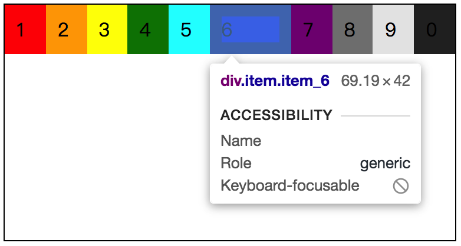

好像除了第六个 flex 元素的宽度变了，其他的感觉上并没有太大的变化。这个主要是因为 flex 是弹性布局，我们在没有具体控制每个 flex 元素的弹性特性时，现在所看到的宽度也并非是真实的宽度。而且，在 flex 弹性布局中，如果 `flex-direction` 是默认值 `row` 的话，是会一行排列下去的，因此，我们就需要考虑增加一个 `flex-wrap` 属性来让其换行展示。

```css
/* 
  file: flex_0026.css
  在 flex 元素增加宽度之后的 align-items: flex-start; 对齐展示效果；
  让 flex 元素具有换行特性；
*/
.demo {
  flex-wrap: wrap;
......
```

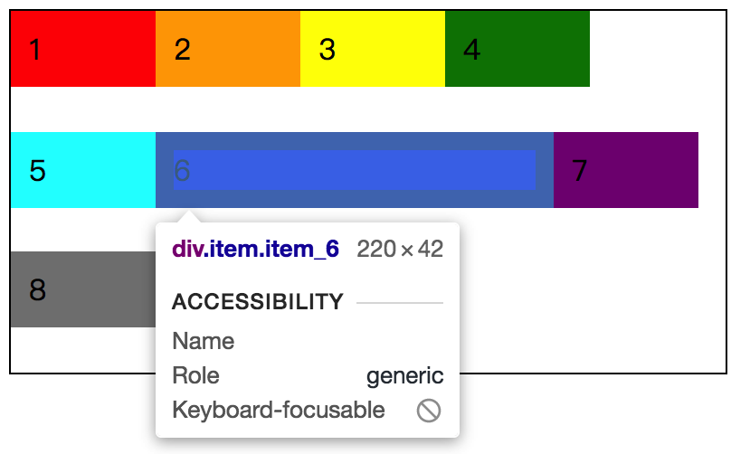

现在这样，如果一行放不下，就换行展示，最终的 flex 元素的宽度也是正确的了。这里需要注意，目前 flex 容器是有 `height` 值，浏览器会根据具体的高度值，将 flex 元素等分排列。

#### flex 容器大于 flex 元素的高度总和时

就如上图所示，在未使用 `stretch` 时，会产生相近值的间距。

#### flex 容器小于 flex 元素的高度总和时

在未设置任何与 `overflow` 相关的属性时，这种情况下，我们可以看到 flex 元素就是超出 flex 容器的。而如果我们在这种情况下对 flex 容器增加 `overflow` 属性，那么就可以实现截断或者滚动的效果。

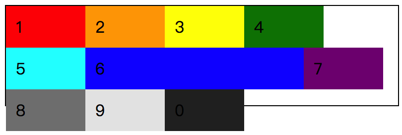

### flex-end

在了解了 `flex-start` 之后，那么对于 `flex-end` 就简单易懂了，**start** 是在起始线的位置开始对齐，那么 **end** 就是终止线的位置开始对齐了。

```css
/* 
  file: flex_0027.css
  基于 26号 demo 的情况改变 align-items 值为 flex-end 后的页面效果
*/
.demo {
  flex-wrap: wrap;
  align-items: flex-end;
  height: 200px;
  /* 在这里给 flex 容器设置了高度 */
  border: 1px solid #000;
}
.item {
  /* width: 60px; */
}
/* 让第 6 个 flex 元素的宽度 变大，看看布局效果的变化。 */
.item_6 {
  /* width: 200px; */
}
```

这里暂时先把 `width` 部分注释，我们看一下 `align-items: flex-end;` 的页面效果。

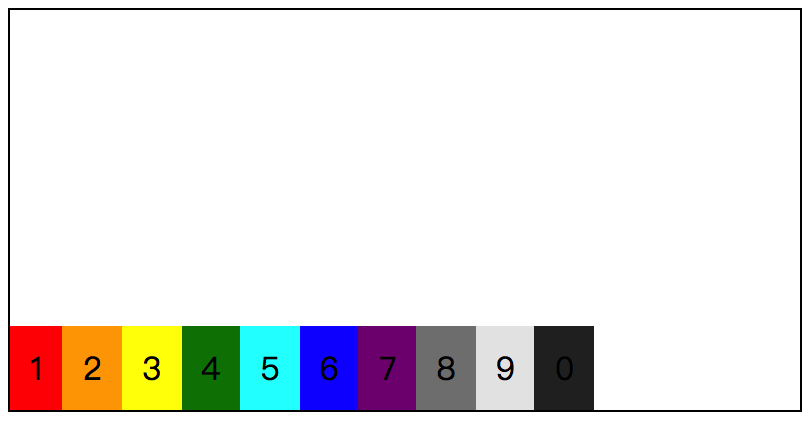

接着我们可以把 `width` 的注释去掉，可以看到效果其实就是从下往上排列，间距是在上方的 flex 元素对齐方式。从感官上可以感受到，是以底部为对齐方式，通过间距将元素均分了。

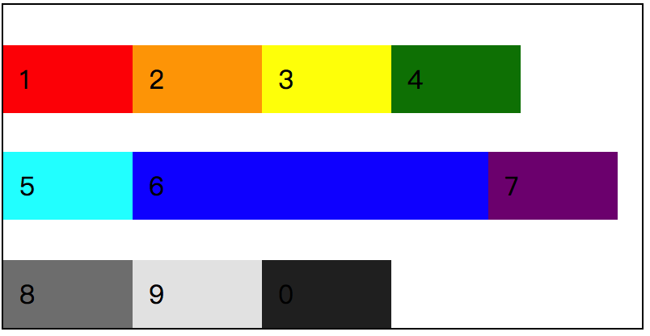

而如果其中有一个 flex 元素的高度有差异，比如我们将第五个 flex 元素的 `height` 设置为 `80px` 的话，将会看到这样的一个布局排列情况。

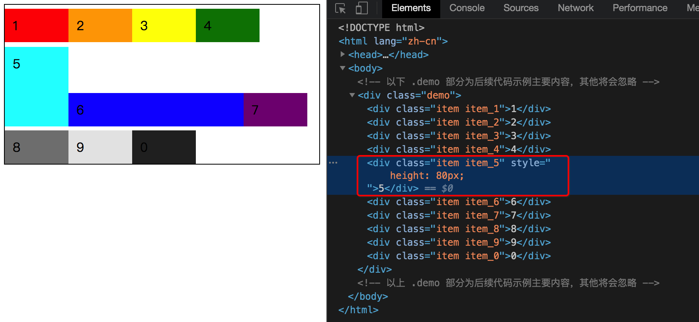

这时我们可以看到，第二行的几个元素对齐方式是不是有点不一样了呢？6 和 7 都是相对于 5 的底部对齐的。看到这个，回想一下 `flex-start`，如果我们将 `align-items` 的值换成 `flex-start` 后会是怎么样的呢？

```css
/* 
  file: flex_0028.css
  align-items: flex-start; 时并且第五个 item 高度改变的情况
*/
.demo {
  flex-wrap: wrap;
  align-items: flex-start;
  height: 200px;
  /* 在这里给 flex 容器设置了高度 */
  border: 1px solid #000;
}
.item {
  width: 60px;
}
/* 让第 6 个 flex 元素的宽度 变大，看看布局效果的变化。 */
.item_6 {
  width: 200px;
}
/* 改变第 5 个 flex 元素的高度 */
.item_5 {
  height: 60px;
}
```

按照 `flex-end` 的表现来看，那么这个时候我们能够看到的效果，应该是 6 和 7 会相对于 5 的顶部来对齐，并且整体的 flex 元素是从 flex 容器顶部开始排列下来的。

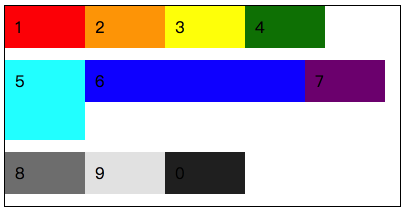

### center

基于对 `flex-start` 和 `flex-end` 的理解，对于理解 `center` 就简单多了。**上中下**、**左中右**，无论我们的如果设置 `flex-direction` 的值，对于 `align-items: center;` 而言，对齐的方式就是中间。我们就对上个 demo 做一个简单调整：

```css
/* 
  file: flex_0029.css
  基于 demo_0028 修改 align-items: center; 后的效果
*/
.demo {
  flex-wrap: wrap;
  align-items: center;
......
```

当 `align-items` 的值为 `center`，我们可以看到 flex 元素的排列方式就是以居中的方式对齐了。

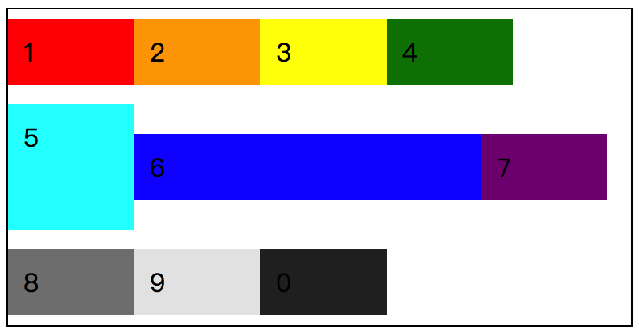

无论是 6 和 7 相对于 5 的对齐方式，还是每个 flex 元素相对于 flex 容器的对齐方式。那么这个时候我们再将每个元素的宽高全部去掉之后，按照之前的 demo 情况来看，应该会看到所有的 flex 元素居中显示。

```css
/* 
  file: flex_0030.css
  flex 元素没有宽高时的 align-items: center; 的对齐方式
*/
.demo {
  flex-wrap: wrap;
  align-items: center;
  height: 200px;
  /* 在这里给 flex 容器设置了高度 */
  border: 1px solid #000;
}
```

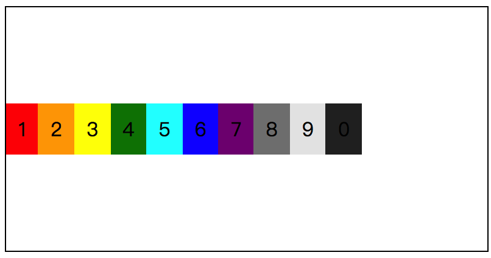

对于已经掌握了 `align-items` 对齐方式的你，这个也就没有任何难度可言，理解起来应该就是那么的简单，那么的容易了。这个时候不知道你是否会想起上个章节中我们学过的 `justify-content` 属性呢？如果这个时候我们再来一个 `justify-content: center;` 之后会是怎么样呢？不妨试试？

前面我们提到，**上中下**、**左中右** ，对于 `align-items: center;` 对齐的结果都是中间，如下调整了之后，flex 元素排列方式改变，但还是在中间。

```css
/* 
  file: flex_0031.css
  改变 flex-direction 后的 align-items: center; 的对齐方式
*/
.demo {
  /* flex-wrap: wrap; */
  align-items: center;
  flex-direction: column;
  /* height: 200px; */
  /* 在这里给 flex 容器设置了高度 */
  border: 1px solid #000;
}
```

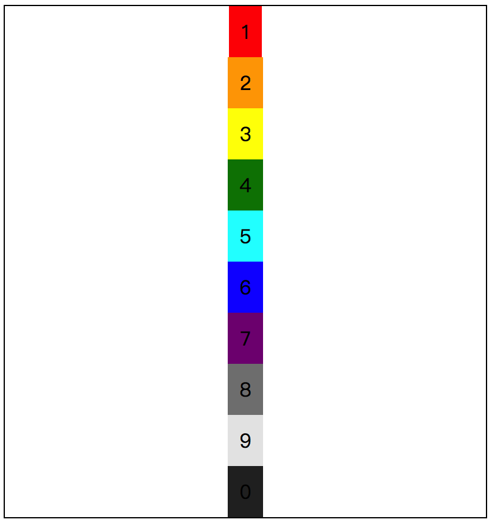

**改变 `flex-direction` 的时候，也将代表改变了主轴与交叉轴交换了位置，但无法改变 `justify-content` 和 `align-items` 分别是相对主轴和交叉轴进行对齐的原则。**万变不离其宗，无论怎么变，我们只要知道了主轴和交叉轴的位置，就能较好地掌握 flex 糖心布局了。

### baseline

在 CSS 的对齐范畴中，不仅仅只有**上中下**几个位置的对齐，还有相对于文本的特性做对齐方式的，比如我们使用 `line-height` 做单行垂直居中，比如使用 `veritcal-align` 做文本垂直对齐方式。这些基本上都是与文本的某些特性有关，比如“基线”。

这个延伸来说明的话，又将会是一篇长文，这里就不扩展了。在 `align-items` 中，我们只要知道，还有一个属性值是 `baseline`，用这个属性值我们可以将 flex 元素以文本的基线为基准做对齐。

```css
/* 
  file: flex_0032.css
  align-items: baseline; 的对齐方式
*/
.demo {
  flex-wrap: wrap;
  align-items: baseline;
  height: 200px;
  /* 在这里给 flex 容器设置了高度 */
  border: 1px solid #000;
}
.item {
  width: 60px;
}
/* 让第 6 个 flex 元素的宽度 变大，看看布局效果的变化。 */
.item_6 {
  width: 200px;
}
/* 改变第 5 个 flex 元素的高度 */
.item_5 {
  height: 60px;
}
```

在这个 demo 中，保持之前的一些属性，修改 `.demo` 中的 `align-items` 属性值为 `baseline`，那么我们可以看到目前的页面效果与 `flex-start` 没什么差别，对吧。

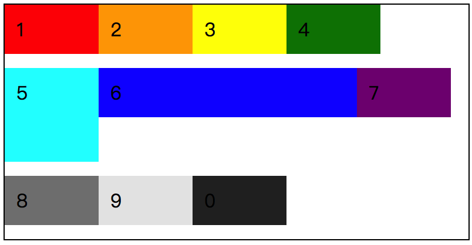

或许这也就是 CSS 的魅力所在，看似相同的效果，但往往隐藏着在特定情况下才会被触发的情况。比如我们现在对 `.item_6` 做一些调整。

```css
.item_6 {
  width: 200px;
  color: #fff;
  /* 将字体大小放大 */
  font-size: 50px;
}
```

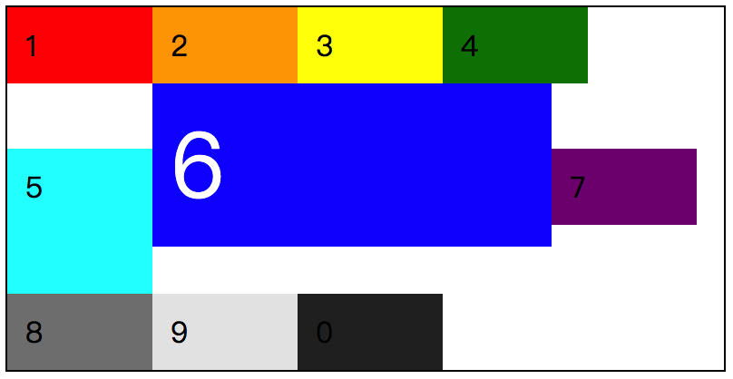

可以看到 `.item_6` 这个元素旁边的的 flex 元素对齐时，无论 `.item_6` 中的字体大小如何变化，对齐的位置是不会改变的。我们来粗浅地了解一下这个所谓的“基线”。

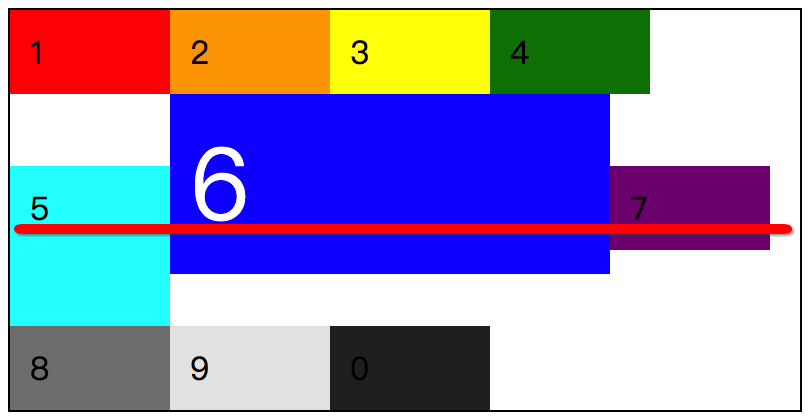

我们在原有的效果图上，增加一条直线，可以看到 5、6、7 这三个数字底部近乎是在一条线上的。对于基线而言，不同的字体在设计之初所设定的极限值不同，最终也将会影响这个对齐的效果。比如我们对全局使用了 `font-family: Georgia;`  并且调整了文字大小 `font-size: 20px;` 之后，会发现如下图的效果，数字 6 不再与 5、7 保持同一条线上了。

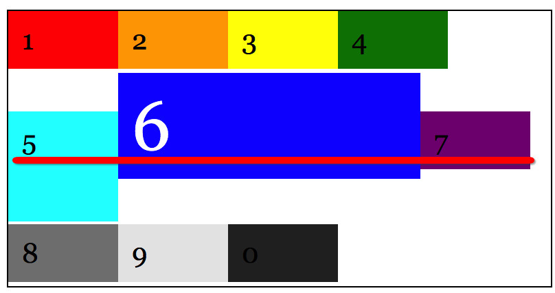

这只是感官上偏移了，但实际上还是以“基线”的方式在对齐元素。在 flex 弹性布局中，`baseline` 的对齐效果，不在乎 flex 元素的文字内容多少，而是在乎于文字大小所影响的基线值。如下图，假设我们把 5、6 的文字内容修改后，会发现 `baseline` 的对齐方式与第一行有关联的。

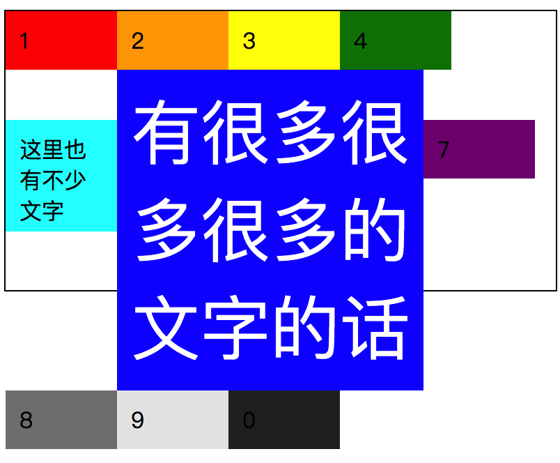

### 小结

`align-items` 以交叉轴为对齐方向，根据不同的属性值表现出不同的对齐方式。

* `stretch` 拉伸的效果与 flex 容器和 flex 元素的 size 有关；
* `flex-start` 、`flex-end` 以及 `center` 是最基本的三个方向的对齐方式；
* `baseline` 将会受到 flex 元素中字体以及字体大小的关系，从而影响对齐效果；