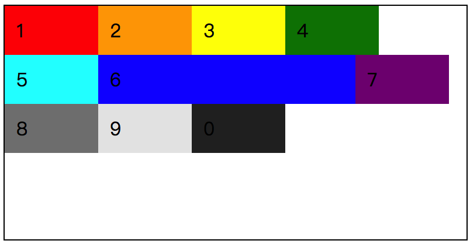
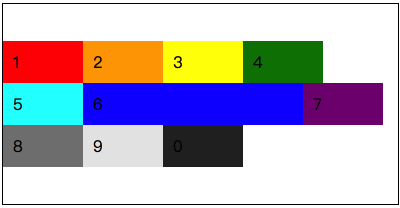
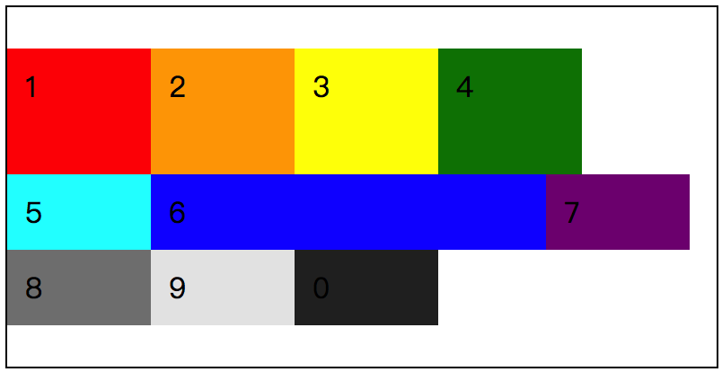

在 flex 容器中设置元素对齐的方式，之前我们提到了使用 `justify-content` 可以设置元素以“主轴”为基准的对齐方式。通过在这个方式，在默认的情况下，我们可以实现 flex 元素在 flex 容器中的水平居中对齐。

就类似于文本的对齐方式一样，我们可以设置文本在一个元素居中对齐，也可以设置该文本在元素中的垂直对齐方式。而在 flex 容器中我们可以设置 flex 元素以“主轴”为基准的对齐方式，那么同样，我们也可以设置以“交叉轴”为基准的对齐方式。

那么这就是我们要介绍的 `align-content` 属性了，该属性在 flex 布局中有以下几个属性值：

* `flex-start`
* `flex-end`
* `center`
* `space-between`
* `space-around`
* `space-evenly`
* `stretch`

对于以上 7 个属性值是不是有种似曾相识的感觉？是的 ，在 `justify-content` 中我们已经见过了，而 `stretch` 这个我们是在 `align-items` 中见过。简单来说，作用其实都是一样的，只不过“参照物”不同而已。

## 属性值介绍

在介绍每个属性之前，再次重申一下，`align-content` 的作用是设置浏览器如何在 flex 容器中，按照“交叉轴”的方向去分配每个 flex 元素之间以及与 flex 容器之间的空间。

**着重说明，`align-content` 对于 `flex-wrap: nowrap;` 设置过后的 flex 布局是无效的。**

### flex-start

按照“交叉轴”的“起始线”位置开始填充 flex 元素，第一个元素与起点位置对齐，一个接一个的排列，放不下的会紧跟换行排列。



这是一个最简单的 demo 效果，为了添加不同的情况，给第 6 个元素加大了宽度。

```css
/* 
  file: flex_0034.css
  align-content: flex-start; 的效果
*/
.demo {
  flex-wrap: wrap;
  align-content: flex-start;
  height: 200px;
  /* 在这里给 flex 容器设置了高度 */
  border: 1px solid #000;
}
.item {
  width: 60px;
}
/* 让第 6 个 flex 元素的宽度 变大，看看布局效果的变化。 */
.item_6 {
  width: 200px;
}
```

### flex-end

相对于 `flex-start` 而言，`flex-end` 就很好理解了。flex 元素是相对于“交叉轴”的“终止线”一个个排列好对齐的，就算是换行也是紧挨着的。


```css
/* 
  file: flex_0035.css
  align-content: flex-end; 的效果
*/
.demo {
  flex-wrap: wrap;
  align-content: flex-end;
......
```

每当这个时候，我时常会感慨，或许这就是 CSS 的魅力吧，一个简单的属性变化，让整个页面发生了完全不同的改变。

### center

简单理解，就是以“交叉轴”为基准，从该轴的中心位置扩散，始终保持 flex 元素第一行与最后一行相距 flex 容器的边缘是相同的距离。同样，我们还是修改一下 demo 中的 `align-content` 的属性值：

```css
/* 
  file: flex_0036.css
  align-content: center; 的效果
*/
.demo {
  flex-wrap: wrap;
  align-content: center;
......
```

那么得到的结果就是：



前面我们提到了一点是，始终保持 flex 元素的第一行与最后一行相距 flex 容器的边缘是相同的距离，从上图中我们已经能够看到效果了。而如果这个时候，我们把第 3 个元素的高度修改的话，得到的结果会是怎么样的呢？是否真的与预期的效果一样，保持距离相同呢？



```css
/* 
  file: flex_0037.css
  基于 align-content: center; 的效果改变 item_3 的高度值
*/
/* ...... */
/* 改变第 3 个元素的高度，查看布局效果 */
.item_3 {
  height: 50px;
}
```

从截图的情况来看，显而易见，先抛开第一行的高度都被拉伸的一个因素暂且不谈，我们可以看到 flex 容器上下两端的间距是十分相近的，肉眼所见，完全就是相同的。

### space-between


