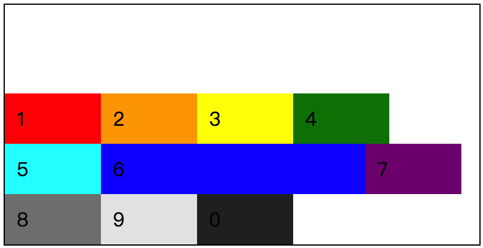
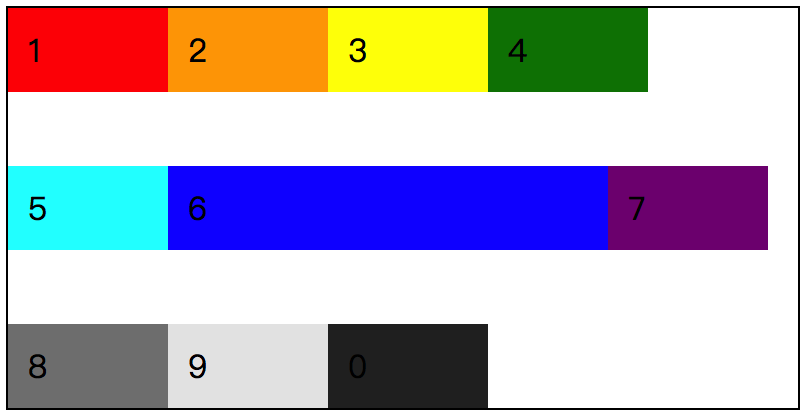
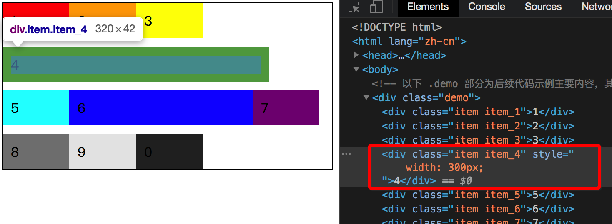
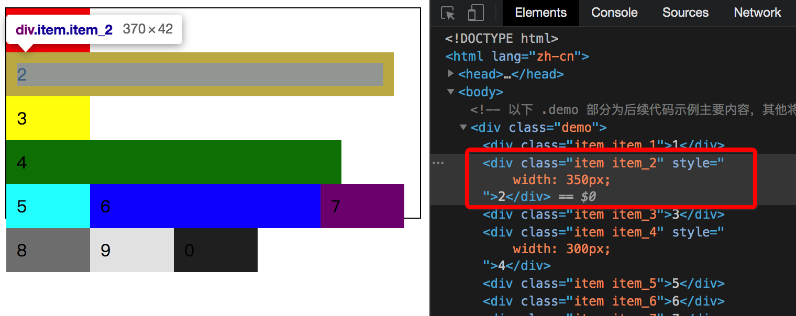
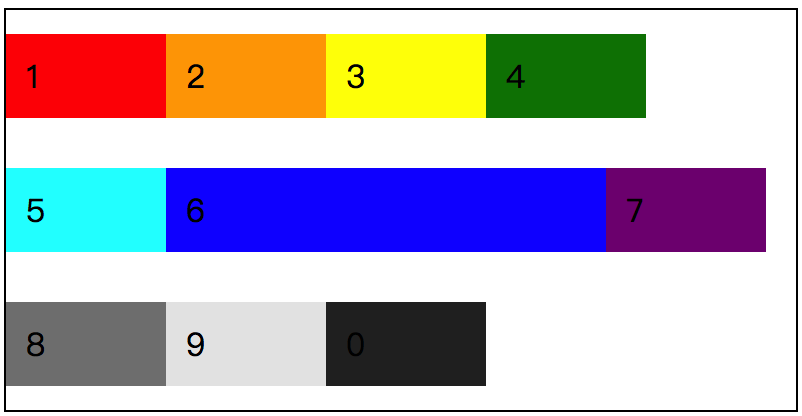
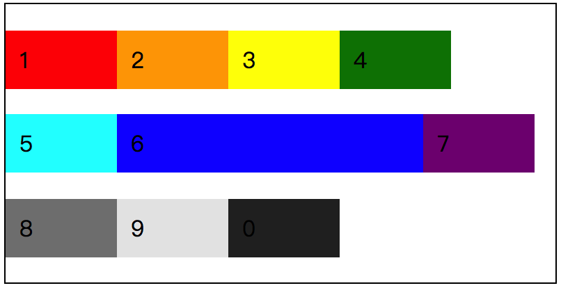
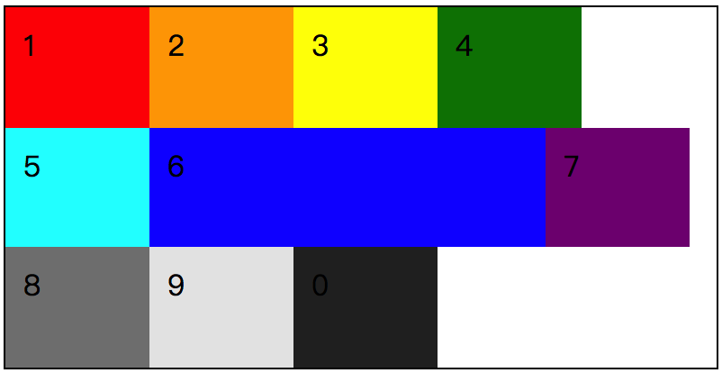

# 📕 flex 容器：align-content

在 flex 容器中设置元素对齐的方式，之前我们提到了使用 `justify-content` 可以设置元素以“主轴”为基准的对齐方式。通过在这个方式，在默认的情况下，我们可以实现 flex 元素在 flex 容器中的水平居中对齐。

就类似于文本的对齐方式一样，我们可以设置文本在一个元素居中对齐，也可以设置该文本在元素中的垂直对齐方式。而在 flex 容器中我们可以设置 flex 元素以“主轴”为基准的对齐方式，那么同样，我们也可以设置以“交叉轴”为基准的对齐方式。

那么这就是我们要介绍的 `align-content` 属性了，该属性在 flex 布局中有以下几个属性值：

* `flex-start`
* `flex-end`
* `center`
* `space-between`
* `space-around`
* `space-evenly`
* `stretch`

对于以上 7 个属性值是不是有种似曾相识的感觉？是的 ，在 `justify-content` 中我们已经见过了，而 `stretch` 这个我们是在 `align-items` 中见过。简单来说，作用其实都是一样的，只不过“参照物”不同而已。

## 属性值介绍

在介绍每个属性之前，再次重申一下，`align-content` 的作用是设置浏览器如何在 flex 容器中，按照“交叉轴”的方向去分配每个 flex 元素之间以及与 flex 容器之间的空间。

**着重说明，`align-content` 对于 `flex-wrap: nowrap;` 设置过后的 flex 布局是无效的。**

### flex-start

按照“交叉轴”的“起始线”位置开始填充 flex 元素，第一个元素与起点位置对齐，一个接一个的排列，放不下的会紧跟换行排列。


这是一个最简单的 demo 效果，为了添加不同的情况，给第 6 个元素加大了宽度。

```css
/* 
  file: flex_0034.css
  align-content: flex-start; 的效果
*/
.demo {
  flex-wrap: wrap;
  align-content: flex-start;
  height: 200px;
  /* 在这里给 flex 容器设置了高度 */
  border: 1px solid #000;
}
.item {
  width: 60px;
}
/* 让第 6 个 flex 元素的宽度 变大，看看布局效果的变化。 */
.item_6 {
  width: 200px;
}
```

### flex-end

相对于 `flex-start` 而言，`flex-end` 就很好理解了。flex 元素是相对于“交叉轴”的“终止线”一个个排列好对齐的，就算是换行也是紧挨着的。



```css
/* 
  file: flex_0035.css
  align-content: flex-end; 的效果
*/
.demo {
  flex-wrap: wrap;
  align-content: flex-end;
......
```

每当这个时候，我时常会感慨，或许这就是 CSS 的魅力吧，一个简单的属性变化，让整个页面发生了完全不同的改变。

### center

简单理解，就是以“交叉轴”为基准，从该轴的中心位置扩散，始终保持 flex 元素第一行与最后一行相距 flex 容器的边缘是相同的距离。同样，我们还是修改一下 demo 中的 `align-content` 的属性值：

```css
/* 
  file: flex_0036.css
  align-content: center; 的效果
*/
.demo {
  flex-wrap: wrap;
  align-content: center;
......
```

那么得到的结果就是：


前面我们提到了一点是，始终保持 flex 元素的第一行与最后一行相距 flex 容器的边缘是相同的距离，从上图中我们已经能够看到效果了。而如果这个时候，我们把第 3 个元素的高度修改的话，得到的结果会是怎么样的呢？是否真的与预期的效果一样，保持距离相同呢？


```css
/* 
  file: flex_0037.css
  基于 align-content: center; 的效果改变 item_3 的高度值
*/
/* ...... */
/* 改变第 3 个元素的高度，查看布局效果 */
.item_3 {
  height: 50px;
}
```

从截图的情况来看，显而易见，先抛开第一行的高度都被拉伸的一个因素暂且不谈，我们可以看到 flex 容器上下两端的间距是十分相近的，肉眼所见，完全就是相同的。

### space-between

flex 容器内的 flex 元素行之间距离保持相等，第一行与最后一行紧贴 flex 容器“交叉轴”的起点位置与结束位置。

```css
/* 
  file: flex_0038.css
  align-content: space-between; 的效果
*/
.demo {
  flex-wrap: wrap;
  align-content: space-between;
......
```



为了能够更好地体现 flex 元素行之间的距离是保持相等，我们可以尝试给不同的 item 添加宽度，使其换行，增加行数，看看多行的情况是怎么样的。



由三行变成四行后，我们可以看到，相邻行之间的间距是相等的。在该 demo 中，外层的 flex 容器高度是固定的，可以通过外边框的黑线可以看到。那么，如果这个时候有一个元素的宽度也增大了，变成了五行，情况会怎么样呢？



在整个 flex 容器中已经无法再正常容纳了，那么相邻行之间就更不可能会有间隔的空间存在。

### space-around

相对于 `space-between` 而言，差别是在 flex 容器内的第一行元素与最后一行元素距离边缘的距离是相邻行之间间距的一半。

```css
/* 
  file: flex_0039.css
  align-content: space-around; 的效果
*/
.demo {
  flex-wrap: wrap;
  align-content: space-around;
......
```



### space-evenly

相对于  `space-around` 而言，`space-evenly` 的差别是第一行与最后一行相距边缘的距离是与相邻行之间相同的。或者我们可以理解为，flex 元素的行与行之间距离均分了。

```css
/* 
  file: flex_0040.css
  align-content: space-evenly; 的效果
*/
.demo {
  flex-wrap: wrap;
  align-content: space-evenly;
......
```



> 思考：在 `space-between` 中我们尝试让 flex 元素变成多行后，看看每行之间的距离变化，那么在 `space-around` 和 `space-evenly` 这两个属性值中，用同样的方式改变每行之间的距离，会有什么效果呢？

### stretch

拉伸每个 flex 元素，将 flex 容器中剩余的空间平均分配给每行的 flex 元素，使其最终撑满整个 flex 容器。

```css
/* 
  file: flex_0041.css
  align-content: stretch; 的效果
*/
.demo {
  flex-wrap: wrap;
  align-content: stretch;
......
```



## 小结

* `align-content` 的对齐方式主要是以“交叉抽”为基准，在 flex 容器中对齐排列 flex 元素。每个属性值都会有不同的效果，并且还会受到 flex 容器的大小影响每行 flex 元素的展示方式。
* 同时需要注意的是，`align-content` 对于使用了 `flex-wrap: nowrap;` 的 flex 布局是无效的。
* `align-content` 是相对于“交叉轴”的，而 `justify-content` 是相对于“主轴”的。
* `align-content` 是**排列** flex 元素而 `align-items` 是控制 flex 元素的**位置**，想象一下 `align-content: space-around;` 和 `align-items: baseline;`，不要被 `flex-start` 这几个相同的属性值而误导；

