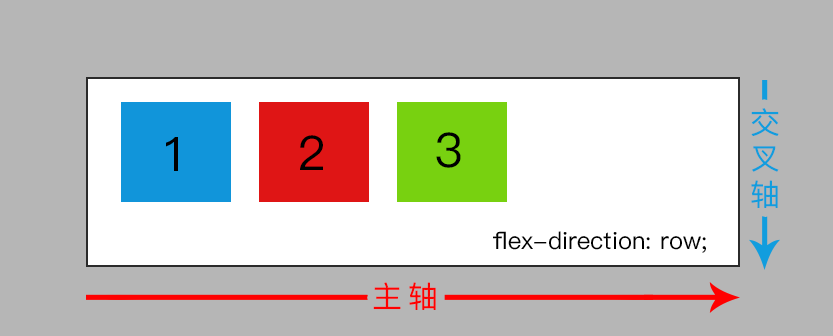
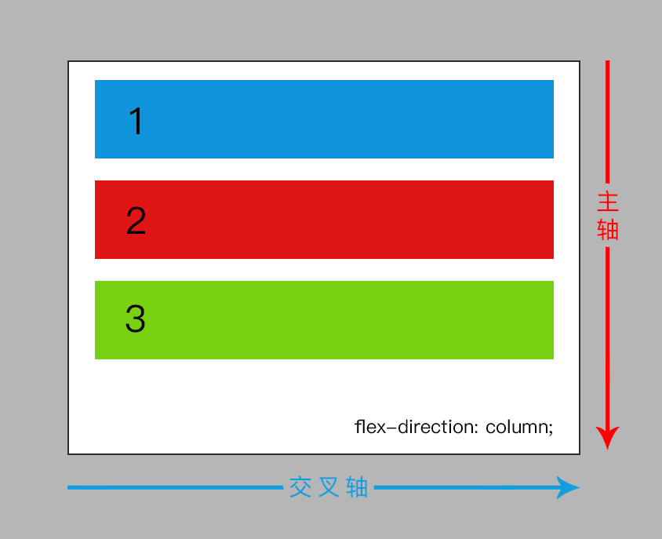
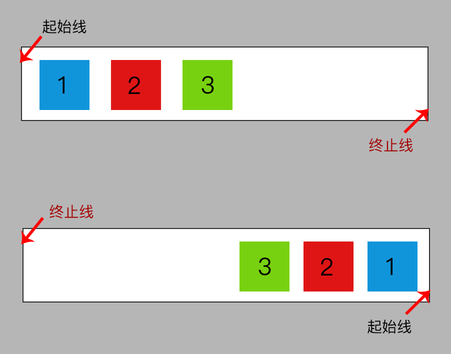
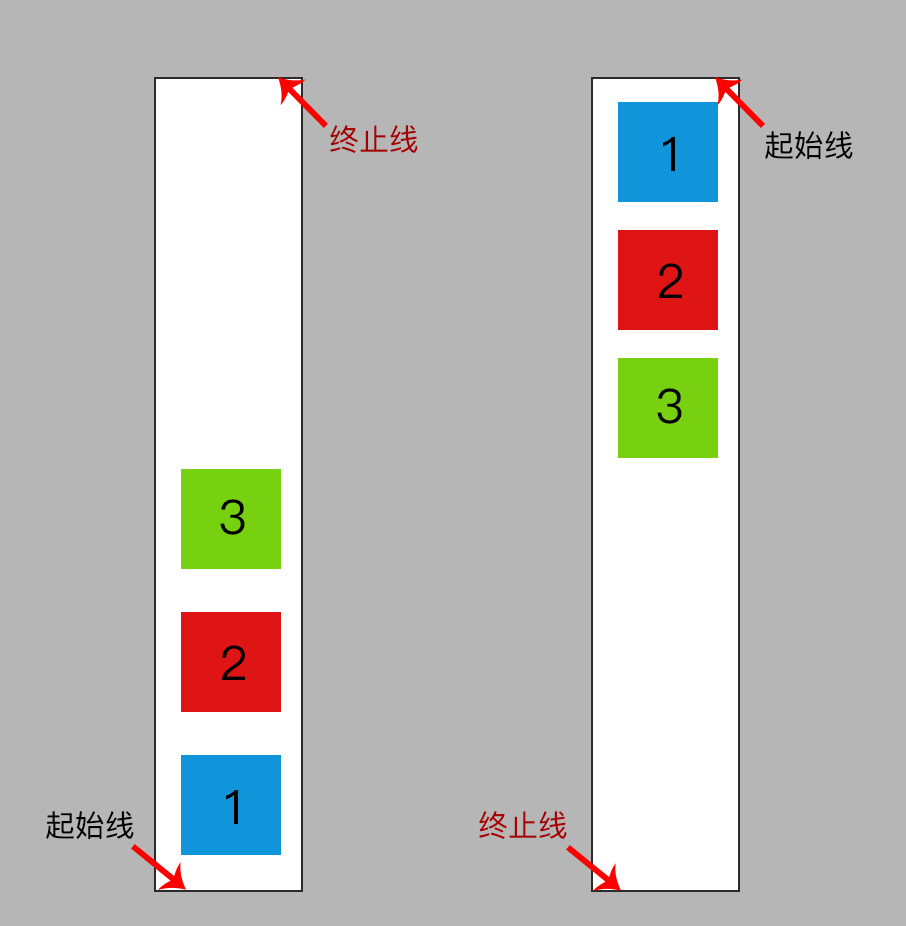

在 flex 弹性布局中，涉及到属性主要是父元素以及其子元素的相关属性，按照这个特性，我们可将 flex 弹性布局相关属性分为 **flex 容器**和 **flex 元素**两个类别。

## flex 容器相关属性
容器层的相关属性，顾名思义，就是指包含着内容的一个“器皿”，简单来说，也就是 flex 弹性布局的父级元素所拥有的属性，主要有：

- `display` 
- `flex-direction` 
- `flex-wrap` 
- `flex-flow` 
- `justify-content` 
- `align-items` 
- `align-content` 

这几个属性就是的作用就是声明当前元素是 flex 弹性布局的容器层，以及控制该容器中各个元素的显示方式。具体的后面会逐一介绍。

## flex 元素相关属性
所谓元素是相对于容器而言的，主要是指在一个具有 flex 弹性布局特性的容器中的所有子元素，在该容器中能够改变自身的相关属性以满足 flex 弹性布局。元素相关属性主要有：

- `flex-grow` 
- `flex-shrink` 
- `flex-basis` 
- `flex` 
- `align-self` 
- `order` 

其实主要就是 `flex` 、 `align-self` 和 `order` 这三个属性， `flex-grow` 、 `flex-shrink` 和 `flex-basis` 是可以简写为 `flex` 的，具体的后面我们再逐一介绍。

## flex 布局中的轴
在后面开始逐一介绍每个 flex 属性之前，我们首先了解一下，在 flex 布局中所存在的一个叫做“轴”的概念。

在 flex 布局中的“轴”是由“主轴（main axis）”和“交叉轴（cross axis）”这两根轴组成，“主轴”是根据 `flex-direction` 而定，“交叉轴”则是垂直于“主轴”的那根。由于“主轴”是随 `flex-direction` 的值而变化位置，可能是横向的，也有可能是纵向的；但无论是哪个方向，“交叉轴”必定是垂直于“主轴”的那根。

如上图所示，当我们选择使用 `flex-direction: row;`的时候，“主轴”的位置是横向的。而如下图所示，当我们使用 `flex-direction: column;` 的时候，“主轴”的位置就是纵向的了。但无论主轴是在什么位置，“交叉轴”必定是相对垂直于“主轴”而存在的。

在 flex 弹性布局中，理解“主轴”和“交叉轴”的概念是有必要的，因为后面在所提到的对齐 flex 元素时，基本上就是相对于“主轴”和“交叉轴”这两条轴线而实现的。比如水平垂直居中一个元素，那么就是让 flex 元素相对于“主轴”和“交叉轴”的中间位置对齐。

## flex 布局中的“起始线”和“终止线”

在 CSS 布局中，**一般情况**的书写模式主要是被认为水平方向，且从左到右。从左开始的位置，就是平时我们使用 CSS 布局时的“起始线”，直到换行的位置就是“终止线”了，如果出现换行，那么新的一行就会出现这行的下面。

而对于我们现在所说的 flex 弹性布局，鉴于弹性的概念，灵活多变，就不再以上下左右的方式来标明 flex 容器的“起始线”和“终止线”了。

以这张图为例，代码所展示的环境是中文以及仅仅设置了 `display: flex;` 在父级元素，因此现在的“起始线”是在红色的 1 这边，然后按照中文的书写习惯往右过去，到最后的黑色 0 结合，也就是到了“终止线”。

在这里提到两个因素影响点：

* 语言环境：最为明显的是阿拉伯文，是从右到左，英文以及中文是从左到右。当然，也可以通过 `direction` 来改变文本显示方向，这就是另外一个话题了；
* `flex-direction`：在 flex 弹性布局中，我们可以通过设置 flex 容器中的 `flex-direction` 随时改变其 flex 元素的方向，也就是改变“轴”，一旦“轴”被改变之后，那么在 flex 布局中的“起始线”和“终止线”也将随之改变；

为了能够更好地理解记忆这所谓的“起始线”和“终止线”，我们其实可以这么理解，在 flex 弹性布局中，只要第一个元素出现的位置，那么“起始线”必然是在这个元素的旁边，具体是在哪一边，那么就看第二个元素从哪个位置开始出现。

如图所示，当我们改变了元素 1 的位置时，“起始线”的位置也将随之改变。那么如果我们这个时候将 flex 弹性布局的方向改为行（column）的话，“起始线”的位置也将随之变化，如下图所示：

**所以简单来说，第一个 flex 元素从哪里开始，那么“起始线”就从哪里开始，“终止线”的位置将会根据 `flex-direction` 最终的属性值而变化，也就是 flex 元素排列顺序的方向而决定“终止线”的位置。**

