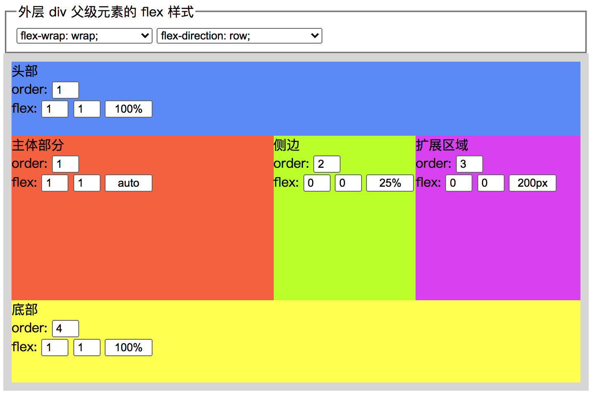

# 📕 实例：前言

断断续续地终于把 flex 相关的属性都过了一遍，本着尽可能地描述清晰一点，希望能够更好地理解 flex 布局中每个属性的一些特点。但是说的再多，不如实际操作来感受一下。

曾经为了让自己更好地理解常用的几个 flex 属性的作用，而做了这么一个简陋的小工具，通过这个工具能够更好地体会几个 flex 属性的效果。

工具地址：https://linxz.github.io/tianyizone/free-flex.html

那么接下来开始，我会通过具体的布局实例效果跟大家一起感受 flex 布局的便捷。当然，有一点必须要明确的，flex 弹性布局不是万能药，不要银弹，我们只不过是尽可能合理地利用 flex 相关属性实现一些相对比较常用的页面布局效果。

大概会有以下几种大的类型，其中所包含的会有一些常见的布局：头尾中间三列、九宫格、页面导航等：

* 一行一列；
* 一行两列；
* 一行三列；
* x 行 y 列；