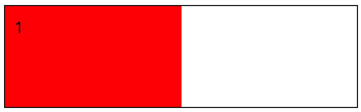

网页是由 N 个个体元素组成的，每个元素在不同的 CSS 属性下会得到不同的结果。那么在 flex 弹性布局中，一个 flex 容器内仅有一个 flex 元素时，我们可以对这个元素做什么呢？或许可能会想到**一个未知大小的元素水平垂直居中**。

是的，这个的确是一个情况。不过，就我个人体会而言，应该更多地了解 flex 元素结合不同的 CSS 属性所展示的结果，这样对于在页面布局时会更有利。

```css
/* 既然只有一个元素，那么其他元素就先消失吧 */
.item:nth-child(n+2) {
  display: none;
}
```

这样就可以得到一个干干净净的只有一个 flex 元素的内容。

```css
/*
  file: flex_0055.css
	一行一列的 flex 元素布局情况的准备
*/
.demo {
  height: 100px;
  /* 在这里给 flex 容器设置了高度 */
  border: 1px solid #000;
}
/* 既然只有一个元素，那么其他元素就先消失吧 */
.item:nth-child(n+2) {
  display: none;
}
/* 下面开始是对一个元素的定义 */
.item_1 {

}
```


### 水平垂直居中

这个水平垂直居中是不受元素的宽高控制，只会根据元素的宽高情况来定位，大概效果如下：


整个实现起来也简单，按照前面的 **flex_0055.css** 的情况，我们可以看到 **item_1** 这个元素是拉伸的情况。处理这个拉伸的情况，如果仅仅只是从 **item_1** 元素自身来考虑的话，那么我们可以这样：

```css
.item_1 {
  align-self: center;
}
```

在仅有一个元素的情况下，如果我们通过这个方式来修改 **item_1** 的 `align-self` 属性，那么这个时候将会以“交叉轴”的方向来居中对齐，也就是垂直居中了。

接下来要做的是水平居中。控制 flex 容器中元素相对于“主轴”的对齐方式，我们要使用的是 `justify-content` 这个属性。所以，我们只要这样就可以得到一个水平垂直居中的 flex 布局。

```css
/*
  file: flex_0056.css
  一行一列的 flex 元素布局情况 1
*/
.demo {
  height: 100px;
  /* 在这里给 flex 容器设置了高度 */
  border: 1px solid #000;
}
/* 既然只有一个元素，那么其他元素就先消失吧 */
.item:nth-child(n+2) {
  display: none;
}
/* 下面开始是对一个元素的定义 */
.item_1 {
  align-self: center;
}
.demo {
  justify-content: center;
}
```

在这里对于“交叉轴”的对齐控制，我们使用的是 `align-self`，这个属性是对于 flex 元素自身的。相对的，还有一个 `align-items` 是可以在 flex 容器中设置居中的属性值。只不过 `align-items` 是会将 flex 容器内所有元素按照“交叉轴”的方向对齐。

但，我们现在其实只有一个元素，所以，不用担心，水平垂直居中的布局方式，我们还可以这样来实现。

```css
/*
  file: flex_0057.css
  一行一列的 flex 元素布局情况 2
*/
.demo {
  justify-content: center;
  align-items: center;
}
```


### 撑满容器的 flex 元素

在前面我们已经看到了，当一个 flex 容器中存在元素的时候，“交叉轴”方向必定是 `stretch` 属性值，会将 flex 元素拉伸。那么我们要实现一个撑满容器的 flex 元素，只要将该元素在“主轴”方向也拉伸就可以了。

“交叉轴”的拉伸可以不仅有 flex 容器上的 `align-item`，还有 flex 元素中的 `align-self` 来控制。对于“主轴”上的拉伸，我们只需要控制 `flex-grow` 的属性值就可以了。

```css
.item_1 {
  flex: 1;
}
```


可这里为什么我用 `flex: 1;` 呢，因为 `flex: 1;` 相当于 `flex-grow: 1; flex-shrink: 1; flex-basis: 0%;`，结果就是我们所需要的，拉伸撑满，所以，简写一下，方便直接。


### 随着父元素改变而改变的 50%

简单来说就是让一个 flex 元素相对于 flex 容器，始终保持在 50% 的宽度而自适应。



根据上面的撑满的效果 `flex: 1;`，可以想象得到，现在我们还是需要在 `flex` 这个属性上做处理。回想一下，`flex: 1;` 所代表的最终效果是什么，是不是改变了 `flex-grow` 的值，而 `flex-basis` 的值是 `0%`。


那么我们想一下，**随着父元素改变而改变的 50%**，这里提到了两个点：

* 随着改变而改变，也就是自适应了；
* 50%，说明这个 flex 元素占据的空间比例是父元素的 50%；

结合这两点，我们需要保证 flex 元素初始值是 50%，并且宽度是可变化的。所以，首先一点是 `flex-basis: 50%;` 是必定存在了，其次，如果我们设置了 `flex-grow: 1;` 的话，那么元素就撑满了，因此也就是 `flex-grow` 应该为 `0`，不改伸展，但我们还是可以缩的，所以，最终应该就是：

```css
flex-grow: 0;
flex-shrink: 1;
flex-basis: 50%
```

结合上述的属性，我们可以得到一个简写的 flex 结果就是：`flex: 0 50%;`，这也就是我们最终的样式情况了。而为什么不能直接 `flex: 50%;` 呢，回想一下介绍 `flex` 属性时提到的一个情况就明白了。


如果直接是 `flex: 50%;` 的话，我们最终也就将 `flex-grow` 的值改变为 `1` 了。

```css
/*
  file: flex_0059.css
  一行一列的 flex 元素布局情况 4
*/
.demo {
  height: 100px;
  /* 在这里给 flex 容器设置了高度 */
  border: 1px solid #000;
}
/* 既然只有一个元素，那么其他元素就先消失吧 */
.item:nth-child(n+2) {
  display: none;
}
/* 下面开始是对一个元素的定义 */
.item_1 {
  flex: 0 50%;
  /* 鉴于 item 有 padding，因此改变 box-sizing 的计算方式为 border-box */
  box-sizing: border-box;
}
```


### 小结

掌握一行一列的处理方式，我们就可以明白一个元素对于自身盒子大小的控制，以及可以了解到如何通过其父元素，甚至是自身元素的一些属性特性，从而决定元素最终所展示的位置。控制了元素的大小和位置，也就可以把握好页面的布局。

