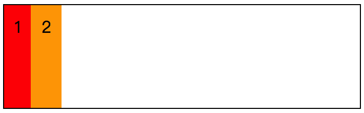
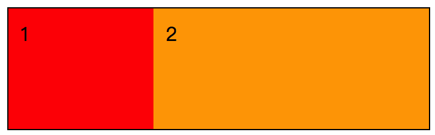
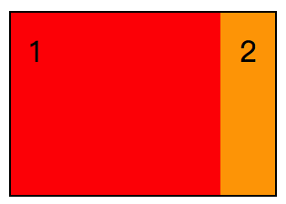
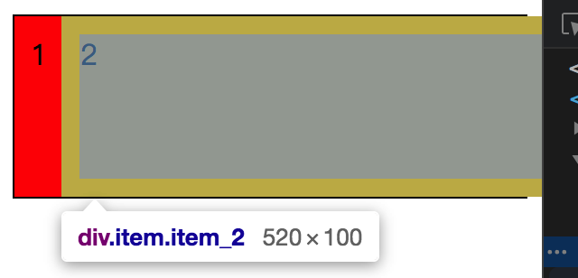
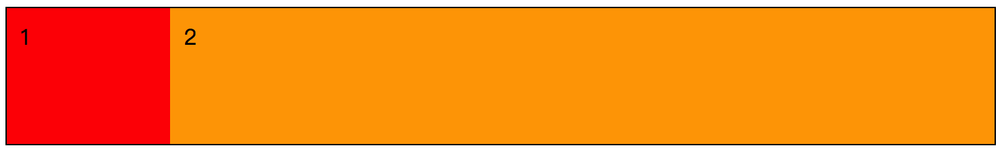
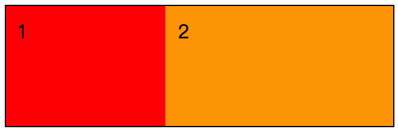
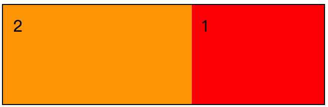
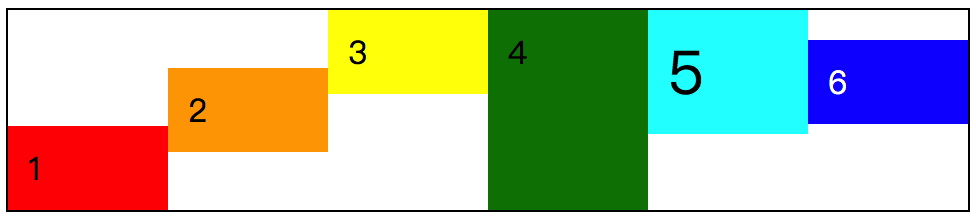

一行两列，能够做的页面布局效果或许有，固定与不固定宽度的，自适应与不自适应宽度的，左右两列位置灵活改变，甚至还有两列等高之类的情况。在 flex 弹性布局中，只要我们能够将 flex 相关的属性理解透彻，就可以很容易满足这些需求。



这是一个初始状态下的一行两列的 flex 布局，目前的样式如下，后续 demo 将会在此基础啥演变。

```css
/*
  file: flex_0060.css
  一行两列的 flex 元素布局情况的准备
*/
.demo {
  height: 100px;
  /* 在这里给 flex 容器设置了高度 */
  border: 1px solid #000;
}
/* 既然只有两个元素，那么其他元素就先消失吧 */
.item:nth-child(n+3) {
  display: none;
}
/* 下面开始是对两个元素的定义 */
.item_1 {

}
.item_2 {

}
```


### 一列定宽一列自适应

在 PC 端的页面中，这种布局还是很常见的，尤其是一些后台数据管理界面，侧边是一些功能菜单，宽度一般是固定的，然后主要内容区域的宽度是自适应，占据浏览器剩余的空间。



如上图所示的效果，**item_1** 区域是固定高度，**item_2** 的宽度将会随浏览器的窗口大小而改变。

```css
/* 下面开始是对两个元素的定义 */
.item_1 {
  width: 100px;
}
.item_2 {
  flex: 1;
}
```

但是这里的 **item_1** 可能会有一个问题，就是当浏览器窗口变得很小时，会有缩小的可能性出现。毕竟该元素是 flex 元素，`flex-shrink` 的默认值是 `1`。如考虑这个细节问题的话，那么就记得加上 `flex-shrink: 0;`，或者将上述的 `.item {}` 部分修改如下

```css
.item_1 {
  flex: 0 0 100px;
}
```

这个细节问题既然在意了。那么就一定更在意 **item_2** 部分在浏览器窗口或者父级元素很小时所显示结果。类似下图的情况，应该不是大家所想看到的结果。



因此，我们需要给 **item_2** 一个最小宽度，保证其不会因为浏览器缩小而变得十分窄小。所以，当我们给 `.item_2 {}` 添加一个最小宽度之后，效果就变成这样了。

```css
/*
  file: flex_0061.css
  一行两列的 flex 元素布局情况 2
*/
......
.item_2 {
  flex: 1;
  min-width: 500px;
}
```



**item_2** 的情况是已经符合我们的预期了，页面可以滚动页面的横向滚动条看到更多的 **item_2** 内容。但是 **item_1** 这个是什么情况呢？其实吧，这个就是前面我们所提到的，`flex-shrink` 的关系。现在现在这个 demo 的 flex 容器宽度整体被压缩，但由于 **item_2** 的最小宽度已经限定，能够被压缩的空间只有 **item_1** 了。

为了避免这个情况，我们需要做的就是改变 `flex-shrink` 的值，使其不可缩。

```css
......
.item_1 {
  width: 100px;
  flex-shrink: 0;
}
......
```

所以，当我们加上这个之后，现在所看到的一列定宽一列自适应，就已经可以算是满足了。




### 两列具有特定比例的自适应

所谓具有特定比例的自适应，简单来说，就是 **item_1** 占据 40%，**item_2** 占据 60%。对于这样的情况来说，基于上面一个 demo 的例子，我们其实可以很简单就实现了。有差异的点需要注意，因为现在是按照特定比例的自适应，也就是说，flex 的弹性功能在这里是不能去掉，这两个元素是可以缩放的。

```css
/*
  file: flex_0063.css
  一行两列的 flex 元素布局情况 3
*/
......
/* 下面开始是对两个元素的定义 */
.item_1 {
  flex: 40%;
}
.item_2 {
  flex: 60%;
}
```



是的，就是这么简单。因为我们只要明白 `flex` 这个简写属性所代表的含义作用，那么我们处理 flex 弹性布局的时候就会得心应手了。


### 左右两列随意更换

在 `float` 的情况，我们可能是需要修改 `float: left;` 和 `float: right;` 的属性值可以得到两列左右切换；或者通过使用负 `margin` 的方式。总之呢，通过 CSS 实现左右两列在不改动 HTML 的前期下随意切换还是比较容易的。

但在 flex 弹性布局中，这个就更简单了，别说是两列，就算是多列，也一样随时可以更换每列的位置，且不改动 HTML 标签。这只需要使用 `order` 这个属性就可以了。

```css
.item_1 {
  order: 1;
}
```

我们只需要给 **item_1** 增加一个 `order: 1;` 的值，改变其默认的计算方式，那么就可以得到这样的效果。




### 两列等高

在 flex 布局出现之前，两列等高的算是 CSS 布局中一个热门话题了。但是现在有了 flex 弹性布局之后，还要说两列等高么？显然不需要了。就从本章开始所有的 demo，都是两列等高的。因为有一个 `align-self` 属性存在。

如果我们将 `align-self` 的默认值 `strech` 修改为其他属性值，那么这个等高也就不见了。甚至还可以实现高高低低的布局效果。




### 小结

flex 弹性布局对于日常的页面布局效果来说，简化了许多。只要我们能够清晰地明白 flex 相关属性的特性，实现一个页面布局效果，或许就是这么简单。

一行一列、两列的页面布局效果已经大概描述过了，在页面布局中，常见的还有一个一行三列的布局效果。不过想了想，三列的页面布局无法就是在两列的基础上再增加一个 flex 元素，然后通过 flex 的属性进行调整位置、大小等。只要我们掌握了一行一列、一行两列的页面布局，一行三列，甚至一行多列的布局情况，都差不多，万变不离其宗。

变来变去，都是这样，明白了原理，也就没什么问题了。