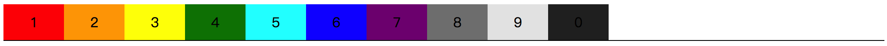
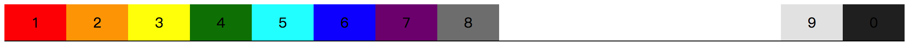
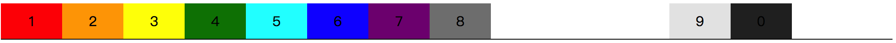
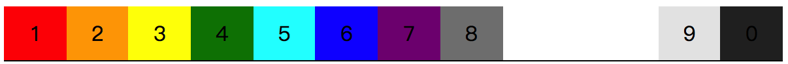
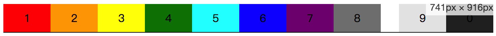
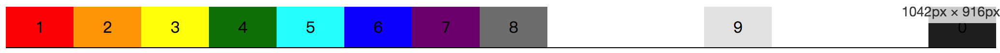

# 📕 实例：导航条

看到这个导航条，可能有人会疑惑，导航条不就是一行中每个元素肩并肩排好队伍就可以了，有什么好讲的呢。的确，按照常规的方式，导航条无非大概就是下面这张图的样子。



那如果我们稍微有点变化，希望后面两个 **item** 元素是居右显示的，而前面 8 个 **item** 是居左显示的，就像这样：



那么这个时候我们应该怎么办呢？

或许有人会说，可以使用选择符，让第 9 个 **item** 与第 8 个 **item** 之间增加间距，使用 `margin` 隔开来不就好了么。虽然这是一个办法，但并不灵活，因为你不知道这两个 **item** 之间的间距有多少，

```css
/*
  file: flex_0071.css
  常规导航条的样式
*/
.demo {
  border-bottom: 1px solid #000;
}
.item {
  flex: 0 50px;
  text-align: center;
}
```

这是常规，假设每个 **item** 的宽度初始固定是 `50px`，且不会放大的一个布局效果。那么按照前面的假设，要实现第 9 个 **item** 开始是居右显示的话，使用 `margin` 来的确是一个方式，但不能使用具体的值，那么如果使用百分比会如何呢？

先不说具体要用多少的百分比值，如果像这样使用 `20%` 的值，会怎么样呢？

```css
.item_9 {
  margin-left: 20%;
}
```



显然，现在看着是不够的。但，如果我们把浏览器的窗口缩小的话……



看着是“完美”了，满足了需求。不过这只是一个假象而已，仅仅只是因为在 `20%` 这个值的基础上，刚好得到了满足。

要不使用绝对定位的方式来处理？用 `position: absolute;` 的话，的确可以将某个元素定位到最后，但仅仅只是某个元素而已，如果是多个元素的话，那么怎么分配定位后的 `left` 或者 `right` 呢？

其实呢，我们还是可以继续在 `margin` 这个属性上去考虑。可以想一想，曾经我们想让一个块级元素水平居中显示的话，是怎么做的呢？是不是这样：

```css
div {
  width: 100px;
  margin: 0 auto;
}
```

是利用了 `margin-left` 和 `margin-right` 的值 `auto`，让一个块级元素由浏览器去计算左右间距的距离，具体的值让浏览器来计算来分配。所以，在这里其实我们也是可以这么操作，让第 9 个 **item** 的左间距为 `auto`，由浏览器来分配剩余的空间。

```css
.item_9 {
  margin-left: auto;
}
```

那么这个时候，当我们对浏览器进行缩放，会发现第 8 和第 9 个 **item** 之间的距离会不断地在改变，而当浏览器足够小，他们之间的无法产生距离的时候，就贴合在一起了。



使用 `margin-left` 是让 8 和 9 之间有间距，那么同时我们给 `.item_9` 加上 `margin-right: auto;` 是不是就让 9 和 0 这两个 **item** 之间也有间距了呢？具体间隔值是不是还是由浏览器来分配，就像 `margin: 0 auto;` 一样，让一个元素居中。

嗯，如果我们这个时候给 `.item_9` 加上 `margin-right: auto;` 不就是 `margin: 0 auto;` 的感觉了么，那是不是说这第 9 个 **item** 会居中呢？

如果会居中，那么是相对于浏览器呢，还是说在 `.item_8` 和 `.item_0` 之间去均分空间？

```css
.item_9 {
  margin-left: auto;
  margin-right: auto;
}
```

当这样的时候，我们得到的结果就是：



所以，当 flex 元素中对于 `margin` 使用 `auto` 这个属性值的时候，就让其余相邻的 flex 元素产生间距，且间距值将会有 flex 容器的大小而决定。

